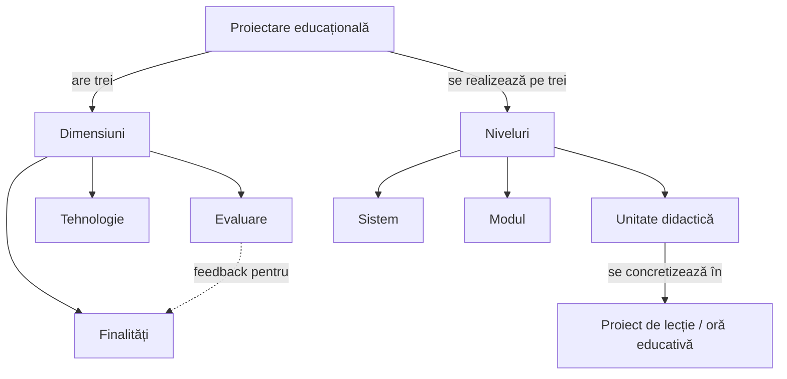

↑ [[00 MOC - Fundamentele științelor educației]] · ↑ [[Modulul 10 - Proiectarea, realizarea și evaluarea activității educative]] · ← [[10.4 Dirigintele - coordonatorul activității educative]]

> [!abstract] Pe scurt
> - Manualul are **11 anexe** (p. 397–428), de trei tipuri:
>   - **instrumente de evaluare**: probe de autoevaluare, test docimologic, portofoliu, subiecte pentru examen;
>   - **ghiduri de muncă intelectuală**: comentariu, rezumat, proiect;
>   - **modele pentru activitatea educativă**: proiect de oră de dirigenție, criterii de evaluare, simulare, formarea competențelor de management al clasei, harta conceptuală.
> - Majoritatea anexelor sunt **schițe**. Se folosesc cel mai bine împreună cu completările metodologice de mai jos.
> - Mai multe anexe sunt **trimise greșit** din text: „Anexa nr. 2” pentru simulare, „anexa 5” pentru criteriile de evaluare.

---

## Tabloul general

| Anexa | Titlu (parafrazat) | p. | Tip | Module legate |
|---|---|---|---|---|
| **1** | Probe de autoevaluare tematică (4 probe) | 397–402 | evaluare / autoevaluare | [[Modulul 06 - Dimensiunile generale ale educației]], [[Modulul 07 - Noile educații]] |
| **2** | Test docimologic de autoevaluare curentă (40 de itemi) | 403–406 | evaluare curentă | [[Modulul 01 - Statutul științelor educației]], [[Modulul 02 - Clasic, modern și postmodern în educație]], [[Modulul 03 - Formele generale ale educației]], [[Modulul 05 - Paradigmele pedagogiei și cercetarea pedagogică]], [[Modulul 08 - Sistemul de educație și managementul educației]] |
| **3** | Activitate individuală: portofoliul + planificarea lucrului individual | 407–409 | evaluare alternativă; organizarea studiului | toate; sarcina 4 → Modulul 10 |
| **4** | Sugestii pentru comentariu și rezumat | 410–411 | muncă intelectuală | toate |
| **5** | Model de proiectare operațională: ora „Meseria — brățară de aur” (cl. a IX-a) | 412–415 | model de oră de dirigenție | [[10.3 Activitatea educativă a dirigintelui]] |
| **6** | Sugestii pentru elaborarea proiectului educațional | 416–417 | metodă de învățare/evaluare | [[10.1 Proiectarea activității educaționale]] |
| **7** | Sugestii pentru evaluarea proiectului, a orei educative și a activității dirigintelui | 418–421 | grile de evaluare | [[10.3 Activitatea educativă a dirigintelui]], [[10.4 Dirigintele - coordonatorul activității educative]] |
| **8** | Model de formare a competențelor cadrului didactic în managementul clasei | 422–423 | modul de formare continuă | [[10.4 Dirigintele - coordonatorul activității educative]], [[Modulul 09 - Agenții educației și factorii dezvoltării]] |
| **9** | Harta conceptuală (schemă) | 423 | organizator grafic | toate |
| **10** | Sugestii pentru aplicarea metodei „Simularea” | 424 | metodă interactivă | [[10.3 Activitatea educativă a dirigintelui]] |
| **11** | Subiecte pentru proba de evaluare finală (60) | 425–428 | examen | toate |

---

## Anexa 1. Probe de autoevaluare tematică (p. 397–402)

**Ce conține.** Patru seturi de întrebări:

| Proba | Tema | Nr. itemi | Exemple de sarcini (parafrazate) |
|---|---|---|---|
| 1.1 | **Educația intelectuală** | 15 | adaptarea după Piaget (asimilare/acomodare); teoria **culturii materiale** vs. **culturii formale**; ierarhia obiectivelor în pedagogia modernă; mecanismul esențial al educației intelectuale; modelul **elevului creativ**; relația concepție științifică – educație religioasă |
| 1.2 | **Educația morală**; educația civico-patriotică | 12 | etica vs. morala; **realismul moral vs. cooperarea** (Piaget); structura **conștiinței morale** (cognitiv–afectiv–volitiv–acțională); conduita morală ca variabilă; etapa hotărâtoare a educației morale; stabilitatea idealului, valorii și normei |
| 1.3 | **Educația estetică**; educația artistică | 10 | definiția educației estetice; **categoriile estetice**; judecata estetică (subiectiv-obiectivă); tabel cu **sursele frumosului** (natură, mediu social, artă, profesie, învățământ, activitate extracurriculară); efectele mass-media |
| 1.4 | **Domenii noi și perspective** ale educației | 9 | rezistența la schimbare; relația om–mediu; democrația; efectele revoluției industriale; „șocul” aderării României și Bulgariei la UE (2007); **stresul de adaptare** |

**Tipuri de itemi**: alegere **duală** (adevărat/fals), alegere **multiplă**, itemi cu **răspuns deschis** (identificați, explicați, elaborați), **completare de tabel**.

**La ce folosește / cum se aplică.** **Autoevaluare** după studierea modulelor 6 și 7. Studentul răspunde fără suport, apoi verifică în conspect ([[Modulul 06 - Dimensiunile generale ale educației]], [[Modulul 07 - Noile educații]]). Itemii deschiși (ex. „identificați 3 metode care au contat în propria educație morală”) se pot discuta la seminar.

> [!note] Comentariu — precizări de conținut
> - **Piaget (item 1.1/1)**: **asimilarea** integrează datele mediului în **schemele existente** ale subiectului, deci mediul e „transformat” ca să se potrivească schemelor. **Acomodarea** modifică **schemele subiectului** după mediu. Adaptarea este echilibrul dintre cele două.
> - **Item 1.1/4** conține **aceeași variantă de două ori** („atitudini și aptitudini”, la b și d). **Item 1.1/15** are variantele notate **a, b, a**. Sunt erori de redactare.
> - Nu există **cheie de corectare** și nici **barem**, deci autoevaluarea rămâne neverificată.

---

## Anexa 2. Test docimologic de autoevaluare curentă (p. 403–406)

**Ce conține.** 40 de itemi pe teme din primele module:
- **statutul pedagogiei ca știință**: condiții formale, sec. XVII, obiect de studiu, lucrările lui Herbart (itemii 1–6);
- **orientări** sociologice și psihologice; autori centrați pe **societate** vs. pe **individualitate** (Dewey, Durkheim, Montessori, E. Key) (7–9);
- **caracteristicile** educației: prospectiv, permanent, social, axiologic, teleologic, **preventiv** (10–13);
- **funcțiile** educației, exprimate prin simboluri, desene, descrieri în 10–12 cuvinte (14–26);
- **formele** educației (27–32) (→ [[3.2 Educația formală]], [[3.3 Educația nonformală]], [[3.4 Educația informală]]);
- **metodele de cercetare**: ordonare cronologică, etapele observației și ale experimentului, eseuri scurte (33–38);
- **sistemul educațional**: stabilitate, finalități (39–40).

**Cum se aplică.** Evaluare **curentă, formativă**, după modulele 1–3 și 5. Poate fi folosit în întregime sau pe secvențe tematice. Itemii creativi (simboluri, desene) cer apreciere **calitativă**.

> [!note] Completare — ce este un test docimologic
> - **Docimologia** (gr. *dokimé* „probă”, *dokimázō* „a examina”) este știința examinării și notării. Termenul a fost introdus de **Henri Piéron** (anii 1920; sinteza *Examens et docimologie*, 1963), pornind de la studiile despre **variabilitatea notării** între examinatori.
> - Un **test docimologic** este o probă **standardizată**, construită după reguli, cu calități verificabile:
>   - **validitate**: măsoară ce își propune;
>   - **fidelitate**: dă rezultate constante;
>   - **obiectivitate**: acord între evaluatori;
>   - **aplicabilitate**.
> - În literatura românească, itemii se clasifică în trei categorii (ex. A. Stoica, coord., *Evaluarea curentă și examenele*, 2001 — de verificat; I. T. Radu, *Evaluarea în procesul didactic*, 2000):
>   - **obiectivi**: alegere duală, pereche, alegere multiplă;
>   - **semiobiectivi**: răspuns scurt, completare, întrebări structurate;
>   - **subiectivi**: eseu structurat/liber, rezolvare de probleme.
> - **Pași de construcție**: obiectivele → **matricea de specificații** (conținuturi × niveluri cognitive) → redactarea itemilor → **baremul** → aplicare, analiză, revizuire.

> [!warning] Observații critice
> - Titlul „test docimologic” e **forțat**: anexa nu are **matrice de specificații**, **barem** sau punctaj. Mulți itemi sunt deschiși sau creativi (desene, simboluri), deci greu de standardizat.
> - **Item 6**: afirmația că denumirea „Pedagogie” apare **pentru prima dată** la Herbart e inexactă. Termenul e antic (gr. *paidagogía*), iar Kant ținuse prelegeri publicate ca *Über Pädagogik* (1803), înainte de *Allgemeine Pädagogik* a lui Herbart (1806). Herbart rămâne însă fondatorul pedagogiei ca **disciplină sistematică**.
> - **Item 33** amestecă metode de cercetare cu distractori, de ex. „psihoterapia” și „reportajul”. „Ordinea cronologică a utilizării” lor nu e o informație consacrată.
> - **Trimitere greșită**: în [[10.3 Activitatea educativă a dirigintelui]], simularea „Școala democratică” cere grupurilor să folosească „Anexa nr. 2” pentru **regulamentul școlii democratice**. Anexa 2 este însă acest test.

---

## Anexa 3. Activitate individuală (p. 407–409)

### 3.1. Portofoliul (p. 407–409)

**Ce conține.**
- **Definiție**: „cartea de vizită” a studentului, care arată **progresul** cognitiv, atitudinal și comportamental într-un semestru sau an. Este un **pact student–profesor**. Pornește de la un **diagnostic** al nevoilor de învățare, care stabilește obiectivele și criteriile.
- **Tipuri**:
  - **de prezentare** (cele mai bune lucrări);
  - **de progres / de activitate** (toate elementele);
  - **de evaluare** (obiective, strategii, instrumente, rezultate).
- **Structură**:
  - **sumarul**;
  - **argumentarea** (de ce au fost incluse lucrările și cum se leagă);
  - **lucrările**: rezumate, eseuri, referate, fișe de studiu, proiecte, teste, chestionare de atitudini, fotografii, observații, **reflecții**, autoevaluări, **hărți cognitive**, comentariile profesorului.
  - Materialele sunt **obligatorii și opționale**.
- **Evaluare**:
  - **multicriterială**: conformitate cu teoria + **inovativitate și originalitate**; mai ales **calitativă**;
  - se evaluează și **efectul** portofoliului asupra dezvoltării personale și profesionale și a **autoevaluării**;
  - se acordă **calificative**.
- **Avantaje**: flexibil; include **produse** reale; **nestresant**; dezvoltă **autoevaluarea**; implică activ studentul.
- **Dezavantaje**: evaluare **îndelungată**; greu de încadrat într-un **barem**.

**Cum se aplică.** Pentru acest curs, portofoliul poate aduna: conspectele, recenzia, proiectul orei de dirigenție (Anexa 5/6), grila de evaluare a unui coleg (Anexa 7), jurnalele de modul.

> [!note] Completare
> - Definiția clasică din literatura americană: **F. L. Paulson, P. R. Paulson, C. A. Meyer**, *What Makes a Portfolio a Portfolio?* (*Educational Leadership*, 1991). Portofoliul este o colecție **intenționată** de lucrări, care arată efortul, progresul și realizările. Presupune **participarea elevului** la selectarea conținutului, **criterii** explicite de selecție și apreciere și dovezi de **autoreflecție**.
> - **Recomandare practică**: o **rubrică** (grilă de criterii cu niveluri descriptive) reduce dezavantajul „greu de apreciat conform unui barem”.

### 3.2. Planificarea orientativă a lucrului individual (p. 409)

| # | Sarcina | Credite | Ore |
|---|---|---|---|
| 1 | evaluarea impactului **Internetului** asupra comportamentului adictiv al elevilor + strategie de prevenție | 0,67 | 20 |
| 2 | **recenzia** unei surse bibliografice (1 pagină A4, corp 14, spațiere 1,5) | 0,33 | 10 |
| 3 | **studiu** în școala absolvită despre stilurile de predare–învățare–evaluare și impactul lor asupra reușitei | 1 | 30 |
| 4 | **proiectul individual al unei ore de dirigenție** (temă și clasă la alegere) | 1 | 30 |
| | **Total** | **3** | **90** |

- Volumul e **orientativ** și se adaptează preferințelor și posibilităților studentului. Raportul **1 credit = 30 ore** corespunde sistemului **ECTS**.
- Textul are o greșeală de tipar: „comportamentului **adectiv**” în loc de „adictiv”.

---

## Anexa 4. Sugestii pentru comentariu și rezumat (p. 410–411)

**Ce conține.**
- **Comentariul** („dezvoltarea compusă”) solicită **simțul critic**, reflecția, raportarea la experiența și cultura proprie.
- **Particularități**:
  - **diversitatea enunțurilor**: document sau citat; abordare globală sau perspectivă restrictivă; una sau mai multe întrebări;
  - **implicarea personală**;
  - **respectarea subiectului**: definirea termenilor, fără divagații, **argumente complementare**; plan după o schemă directoare; punct de vedere **original și justificat prin exemple**.
- **Greșeli frecvente**:
  - parafrazarea documentului sau generalități fără suport;
  - lipsa de curiozitate față de actualitate;
  - sentimentul (nejustificat) de a nu avea destulă „cultură”;
  - **„mitul inhibitor al corectorului-cenzor”**.
- **Atitudinea cerută**: **precisă, argumentată, susținută de exemple**.
- **Metodologia**:
  - **lectura globală**: tema, problematica, **teza**, firul conducător;
  - **lectura analitică**: ideile și noțiunile-cheie, exemplele importante, **ierarhizarea argumentelor**, reconstituirea structurii.

**Cum se aplică.** Sarcinile de tip „comentați afirmația…” de la seminar și din examen (Anexa 11), recenzia (Anexa 3.2). Un **rezumat** bun păstrează teza și structura argumentării, fără exemple secundare. Un **comentariu** adaugă **poziția argumentată** a autorului.

> [!tip] De reținut
> Rezumat = **ce spune** textul (fidel, condensat). Comentariu = **ce cred eu** despre ce spune textul (argumentat). Conspectele din acest vault urmează aceeași logică: **Partea I** rezumă, **Partea II** comentează.

---

## Anexa 5. Model de proiectare operațională: „Meseria — brățară de aur” (cl. a IX-a) (p. 412–415)

**Ce conține.** Descrierea narativă a unei ore de dirigenție de **orientare profesională**:

1. **Pregătire** (o săptămână): elevii își **completează portofoliul** despre profesia dorită. Notează informații, descriu profesiile părinților și argumentează în scris de ce ar face față profesiei.
2. **Tabelul 1 — „Ghidul-prognoză al viitorilor profesioniști”**: profesiile alese de elevi (plugar, medic, inginer, jurist, contabil, chelner, agronom, profesor…). Câțiva elevi descriu profesia dorită și **calitățile** cerute; de ex. la medic: generozitate, abnegație, compasiune, curaj.
3. **Tabelul 2 — „Condițiile necesare practicării profesiei”**: rubricile *Ce știu / Ce pot / Ce vreau / Ce trebuie să cunosc / Ce trebuie să știu a face*. 5 minute în clasă, apoi acasă. **Concluzia**: pentru *a ști* ai nevoie de studii; pentru *a putea*, de aptitudini; pentru *a vrea*, de voință; în plus, trebuie să fii bine documentat.
4. **Maxime despre vocație, muncă, talent**, discutate și notate în portofoliu (cuvinte-cheie: *muncă, talent, vocație, interes*).
5. **Fișa-perspectivă**: elevii marchează cu „+/–” calitățile proprii față de profesiile dorite. Profesia cu cele mai multe „+” indică orientarea.
6. **Discuție** despre perspectivele de angajare, dificultăți, „cum cresc profesioniștii” (cultura generală ca temelie, studiul continuu).
7. **Exercițiu**: continuarea enunțului „Se caută profesioniști…”.
8. **Invitați** (părinți, specialiști) care răspund la un **chestionar** în 6 întrebări: studii, instituție, calități necesare, discipline relevante, motivele alegerii, avantaje/dezavantaje, depășirea dificultăților.
9. **Aforism final** despre dăruire. **Concluzia** dirigintelui: responsabilitatea față de profesie și consecințele incompetenței.
10. **Sinteză scrisă** a elevilor (5 min), ilustrată cu un fragment dintr-o reflecție de elevă.

**La ce folosește.** Model concret pentru **sarcina 4** din Anexa 3.2 și pentru exercițiul de creativitate din modulul 10. Arată cum se integrează **portofoliul**, **invitații**, **maximele** și **autoanaliza** într-o oră.

> [!warning] Observații critice
> - Deși se numește **„proiectare operațională”**, anexa **nu are** elementele unui proiect: obiective **operaționale** formulate explicit, competențe, durate pe etape, metode numite, **evaluare**. E mai degrabă **descrierea unei activități**. Pentru a o transforma în proiect, folosiți structura din [[10.3 Activitatea educativă a dirigintelui]] (§3) și criteriile din **Anexa 7**.
> - Tabelele sunt **deteriorate** în extragerea textului. Ghidul-prognoză are o coloană cu profesii și una cu numele elevilor.
> - Abordarea e mai ales **morală și motivațională** („vocație”, „sacrificiu”). Lipsesc instrumentele moderne de **consiliere în carieră**: chestionare de interese (tipologia **RIASEC**, J. L. Holland), informații despre **piața muncii**, **plan de carieră** (ca în modulul 4 din *Dezvoltare personală*, RM 2018 → [[10.2 Curriculum la dirigenție]] §9).

---

## Anexa 6. Sugestii pentru elaborarea proiectului educațional (p. 416–417)

**Ce conține.**
- **Proiectul** este prezentat ca **metodă complexă de evaluare**, individuală sau de grup. Încurajează **transferul** de cunoștințe, abordările **interdisciplinare** și abilitățile **praxiologice**.
- **Etape**:
  1. **identificarea problemei/temei**: orientare în sarcină, finalități, concepte-cheie, sarcini și responsabilități în echipă, **criterii de evaluare**, surse de informare, colectarea datelor;
  2. formularea **ipotezelor**;
  3. **modelarea soluțiilor**;
  4. culegerea, organizarea, prelucrarea și evaluarea **informațiilor**;
  5. elaborarea unui **set de soluții** și evaluarea lor;
  6. **aplicarea** soluției alese, pe baza unui **plan de implementare** (etape, resurse, responsabilități, evaluare);
  7. **redactarea** lucrării.
- **Exigențe de redactare**: problemă clar formulată; puncte de vedere **divergente** evaluate; concepte corecte; atitudine **critică**; argumentare solidă; literatura de bază; metode adecvate.
- **Avantaje**: arată cum sunt folosite cunoștințele și resursele; e o **metodă alternativă** de evaluare; studentul își **autotestează** capacitățile cognitive, sociale și practice.

**Cum se aplică.** Un proiect educațional de grupă, de ex. „Campanie de prevenire a violenței în școală”:
- problema: date despre violență;
- ipoteze;
- soluții: ore de dirigenție, mediere între colegi, parteneriat cu părinții;
- plan de implementare;
- raport.

> [!note] Completare
> - **Metoda proiectelor** a fost formulată de **William H. Kilpatrick**, *The Project Method* (*Teachers College Record*, **1918**), în spiritul pedagogiei lui **J. Dewey**. Proiectul este o **activitate intenționată, „din toată inima”**, într-un context social.
> - Azi se vorbește de ***project-based learning*** (PBL). Elemente-cheie: întrebare-problemă autentică, **investigație susținută**, **voce și alegere** pentru elev, reflecție, feedback și revizuire, **produs public**.
> - **Diferența față de Anexa 5**: aici „proiect” = **metodă de învățare-evaluare** a elevului/studentului. Acolo „proiect” = **documentul de planificare** al educatorului. Manualul nu semnalează această **polisemie**.

---

## Anexa 7. Sugestii pentru evaluarea proiectului, a orei educative și a activității dirigintelui (p. 418–421)

**Ce conține.**
- **Trei întrebări de pornire**:
  1. S-a realizat **ce s-a proiectat**?
  2. S-a realizat **eficient și efectiv**?
  3. Are **valoare formativă** pentru elevi?
- Trei grile de criterii:

| Grila | Nr. aprox. de criterii | Ce urmărește (sinteză) |
|---|---|---|
| **A. Evaluarea proiectului** | 9 | elementele cerute sunt prezente; **concordanța** cu planul anual; obiective corect formulate, care acoperă conținutul; temă și conținut potrivite **vârstei**; informație variată și actuală; **coerență logică**; strategiile servesc obiectivele; mijloacele eficientizează metodele; **evaluarea e în concordanță cu obiectivele** |
| **B. Parametrii orei educative** | ≈ 25 | competență profesională; comunicarea obiectivelor; stăpânirea conținutului; **metode variate**, fără monotonie; mijloace folosite și confecționate; succesiune logică și legătură cu practica elevilor; corectarea **cu tact**; motivare; valorificarea fiecărui elev **fără discriminare**; respectarea opiniilor; **timp pentru reflecție**; **ascultare activă și consiliere**; atenție la comportamentul elevilor, nu la propriile acțiuni; parteneriat cu echipa și comunitatea; imparțialitate; climat psihologic; entuziasm; **simțul umorului**; relații formale și informale; evaluarea efectelor |
| **C. Activitatea educativă a dirigintelui** (pe termen lung) | ≈ 35 | inițiativă în probleme școlare și comunitare; receptivitate la provocările lumii; colaborare cu colegii; **autoperfecționare**; implicare în comisia metodică și consiliul profesoral; comunicări metodice din propriile cercetări; preocupare pentru copiii cu **nevoi speciale**; orientare școlară și profesională; valorificarea timpului; **responsabilizarea elevilor**; colaborare cu **părinții**; reducerea absenteismului; integrarea elevului în comunitate; spirit **inovator**; colaborare cu mass-media; confecționarea materialelor; expoziții, cercuri; tact psihopedagogic; **discreție**; echilibru; **nu ironizează și nu discreditează elevii**; parteneriat cu profesorii clasei; rezolvarea **conflictelor** |

**Cum se aplică.**
1. Grila **A** se folosește **înainte** de oră (auto/interevaluarea proiectului). Grila **B** servește la **asistența** la oră. Grila **C** servește la **evaluarea anuală** a dirigintelui (autoevaluare, inspecție, atestare).
2. Pentru uz practic, grilele se transformă în **scale**, de ex. 1 = deloc, 2 = parțial, 3 = în mare măsură, 4 = pe deplin, cu o rubrică de **dovezi/observații**.
3. Aceasta este anexa la care **ar trebui** să trimită exercițiul din modulul 10 (p. 394), care indică greșit „anexa 5”.

> [!warning] Observații critice
> - Criteriile sunt **formulate inegal**: unele sunt observabile („comunică obiectivele”), altele sunt **trăsături de personalitate** greu de evaluat („are simțul umorului”, „manifestă entuziasm”). Există și **suprapuneri** între grilele B și C.
> - Grilele nu au **niveluri de performanță** și nici **ponderi**, deci nu se pot calcula scoruri comparabile.
> - Grila C amestecă **cerințe de bază** (respectarea programului) cu cerințe de **excelență** (comunicări pe baza propriilor cercetări).

---

## Anexa 8. Model de formare a competențelor cadrului didactic în managementul clasei (p. 422–423)

**Ce conține.** Un tabel **competențe – conținuturi – strategii – evaluare**, pentru un modul de **formare continuă** cu tema *Strategii de self-management pentru optimizarea relațiilor cu elevii*:

| Competența vizată | Subiecte | Strategii | Produse de evaluare |
|---|---|---|---|
| strategii de management personal pentru **comunicarea eficientă** cu clasa | 1. Comunicare și **managementul conflictelor**: comunicare **asertivă**, **ascultare activă**, tehnici de **negociere** | joc de rol; lucru în echipe; triada **intervievator – intervievat – observator** | fișa „Comunicarea asertivă”; eseu despre eliminarea barierelor de comunicare profesor–elevi |
| **managementul emoțiilor** elevilor | 2. Managementul emoțiilor: **identificarea, folosirea, înțelegerea, gestionarea** | **metoda acvariului**; joc de rol; ***Circle Time***; cartonașe cu imagini și cuvinte | fișe „Astăzi mă simt…”, „Afișul meu publicitar”, situații care au declanșat emoții |
| strategii de **self-management** pentru relațiile cu elevii | 3. **Pregătirea mentală** a dirigintelui: promptitudinea reacțiilor, **anticiparea dificultăților**, practici de management al clasei, ***reframing***, **monitorizarea propriilor gânduri**, **eliberarea de stres** | joc de rol; masă rotundă; cartonașe colorate, post-it, flipchart, videoproiector | fișe „Lucrurile pe care le fac când sunt…”, „Ce mă ajută când simt că sunt…”; eseu „Gestionarea emoțiilor negative” |

> [!note] Completări metodologice
> - **Cele patru ramuri ale managementului emoțiilor** (identificare – folosire – înțelegere – gestionare) reproduc **modelul inteligenței emoționale** al lui **P. Salovey și J. D. Mayer** (1990; model în patru ramuri, 1997): percepția, **folosirea** (facilitarea gândirii), înțelegerea și **reglarea** emoțiilor. → [[Modulul 07 - Noile educații]] (educația pentru dezvoltare emoțională).
> - **Metoda acvariului** (*fishbowl*): un grup interior discută sau joacă o situație, iar un grup exterior **observă** după criterii. Apoi rolurile se inversează sau se face analiza.
> - ***Circle Time***: întâlnire periodică **în cerc**, cu reguli (vorbește doar cine ține obiectul, dreptul de a „trece”), pentru exprimarea emoțiilor și rezolvarea problemelor clasei. Popularizată în Marea Britanie de **Jenny Mosley** (anii '90).
> - ***Reframing*** (**reîncadrare**): reinterpretarea unei situații dintr-o altă perspectivă, ca să-i schimbi semnificația (de ex. „elevul mă provoacă” → „elevul caută atenție și apartenență”). Termenul vine din **terapia sistemică / școala de la Palo Alto** (P. Watzlawick, J. Weakland, R. Fisch, *Change*, 1974) și a fost preluat în consiliere și în NLP.
> - **Comunicarea asertivă**: exprimarea fermă a propriilor nevoi și limite, cu respect pentru celălalt (între pasivitate și agresivitate). → vezi *Assertive Discipline* (L. & M. Canter, 1976) în [[10.3 Activitatea educativă a dirigintelui]].

---

## Anexa 9. Harta conceptuală (p. 423)

**Ce conține.** O schemă minimală: harta conceptuală este un **grafic** format din **noduri** (= **concepte**) și **trimiteri/legături** (= **cuvinte de legătură**). Anexa nu are exemplu și nici instrucțiuni.

**Cum se aplică (completare).**
1. Alegeți **conceptul central** (ex. „proiectare educațională”).
2. Listați 10–20 de **concepte asociate** (finalități, conținuturi, strategii, evaluare, niveluri, curriculum…).
3. Ordonați-le **ierarhic**, de la general la particular.
4. Legați-le prin **săgeți etichetate cu verbe sau expresii** („cuprinde”, „se realizează prin”, „determină”). Fiecare pereche nod–legătură–nod trebuie să formeze o **propoziție** cu sens: *proiectarea → vizează → finalitățile*.
5. Căutați **legături transversale** între ramuri. Ele arată înțelegere profundă.

> [!note] Completare
> - Harta conceptuală ca instrument de **învățare semnificativă** și **metacognitiv** a fost dezvoltată de **Joseph D. Novak** și **D. Bob Gowin**, *Learning How to Learn* (Cambridge University Press, **1984**), împreună cu **diagrama V** (*Vee heuristic*).
> - **Tipuri** frecvente în literatura didactică: **ierarhică**, **în rețea/pânză** (*spider map*: concept central cu ramuri), **lanț/secvențială**, **ciclică**.
> - **Utilizări**: evaluarea înțelegerii; recapitulare; planificarea unui eseu; componentă a **portofoliului** (Anexa 3, „hărți cognitive”).

---

## Metoda „Păianjenul” — completare (fără anexă proprie)

Metoda „**Păianjen**” apare de mai multe ori în tabelele Curriculumului la dirigenție (clasele a V-a și a X-a, [[10.2 Curriculum la dirigenție]]), dar manualul **nu o descrie** nicăieri. În literatura metodică circulă **două sensuri** (sinteză după practica curentă; de verificat în sursa folosită de curriculum):

| Variantă | Desfășurare | Utilizare |
|---|---|---|
| **„Pânza de păianjen” — joc de grup** | participanții stau în **cerc**. Primul ține capătul unui ghem, spune o idee (un răspuns, o calitate, o emoție) și aruncă ghemul altcuiva, păstrând firul. La final se formează o **„pânză”** care arată vizual **legăturile** și **interdependența** grupului. Se poate desface în ordine inversă, cu recapitularea ideilor | spargerea gheții, recapitulare, reflecție finală, coeziunea clasei |
| **„Diagrama-păianjen” (*spider map*) — organizator grafic** | conceptul sau tema **în centru**; ideile principale pe „**picioare**”; detaliile pe ramificații | brainstorming structurat, analiza unei teme (ex. „calitățile unui profesionist”), planificare |

> [!tip] De reținut
> Varianta „joc” formează **coeziunea** și **ascultarea**. Varianta „diagramă” formează **organizarea ideilor**. Pentru ora de dirigenție, ambele se încheie cu **reflecție**: *ce am observat despre noi ca grup / despre temă?*

---

## Anexa 10. Sugestii pentru aplicarea metodei „Simularea” (p. 424)

**Ce conține.**
- **Definiție**: simularea este **reprezentarea unui fapt**, un **model** care decupează aspecte ale realității. Le permite participanților să trăiască **experiențe asemănătoare celor din viață** și să învețe prin **implicare personală**.
- Integrează diverse tehnici. **Obiective** posibile: **motivație** pentru învățare, **participarea tuturor**, interacțiune de grup, **gândire critică**, capacități de comprehensiune, investigație, comunicare.
- **Proiectarea**: educatorul studiază **nevoile și capacitățile** elevilor. Stabilește clar ce vor câștiga elevii, ce știu deja, cum îi va dezvolta simularea, cum va fi organizată și evaluată.
- **Rolul educatorului în timpul simulării**:
  - **facilitator**, cu intervenție **minimă**;
  - **nu deține „adevărul absolut”**, ceea ce asigură libertatea de gândire și **responsabilitatea** participanților;
  - controlează **timpul**, **observă**, ia **notițe** pentru evaluare și își argumentează aprecierile.

**Cum se aplică.** Exemplul complet este simularea **„Școala democratică”** din [[10.3 Activitatea educativă a dirigintelui]] (§4): roluri (elevi, părinți, profesori, director), sarcina de a elabora un regulament, modalități de decizie, prezentare în plen, generalizare.

> [!note] Completare — etapele unei simulări bine conduse
> 1. **Pregătire (briefing)**: obiective, reguli, roluri, scenariu, timp.
> 2. **Desfășurare (acțiune)**: participanții acționează în rol; facilitatorul observă.
> 3. **Ieșirea din rol**: important mai ales la subiecte cu încărcătură emoțională.
> 4. **Debriefing (analiza)**, etapa în care se produce de fapt învățarea. Un model frecvent în trei pași:
>    - *Ce s-a întâmplat?* (descriere, emoții);
>    - *De ce? Ce am învățat?* (analiză, concepte);
>    - *Cum aplicăm în realitate?* (transfer).
>
> Structura urmează ciclul **învățării experiențiale** al lui **D. Kolb** (1984) (→ [[3.3 Educația nonformală]] §16).
>
> **Simulare vs. joc de rol**: jocul de rol se centrează pe **interpretarea unui personaj**. Simularea reproduce un **sistem sau proces** (o instituție, o decizie colectivă) cu reguli, iar rolurile sunt doar o componentă.
>
> **Limita anexei**: nu pomenește **debriefing-ul**, deși fără el simularea riscă să rămână un „activism de suprafață”.

---

## Anexa 11. Subiecte pentru proba de evaluare finală (p. 425–428)

**Ce conține.** **60 de subiecte**, formulate cu verbe de acțiune: *definiți, argumentați, elaborați o schemă, explicați, determinați, aplicați la o situație concretă, analizați, construiți, evaluați*. Verbele acoperă mai multe niveluri cognitive (cf. taxonomia lui Bloom → [[Modulul 04 - Finalitățile educației]]).

**Corespondența cu modulele** (reconstituită):

| Subiectele | Modulul / tema |
|---|---|
| 1–9 | [[Modulul 01 - Statutul științelor educației]]: concepte, pedagogia ca știință și artă, evoluție, taxonomia lui S. Cristea, relații cu alte științe, **normativitate** |
| 10–13 | [[Modulul 02 - Clasic, modern și postmodern în educație]]: modernizare, funcții, caracteristici, structură; **școala democratică** (13 → simularea din 10.3) |
| 14–15 | [[Modulul 03 - Formele generale ale educației]]: interdependența formelor; **educația permanentă și autoeducația** |
| 16–18 | [[Modulul 04 - Finalitățile educației]]: finalități macro/micro, funcții, **taxonomia obiectivelor** |
| 19–24 | [[Modulul 06 - Dimensiunile generale ale educației]]: educația morală, intelectuală, tehnologică, estetică, psihofizică |
| 25–42 | [[Modulul 07 - Noile educații]]: problematica lumii contemporane; mediu, pace, comunicare și mass-media, participare și democrație, schimbare, **nutrițională**, **economică și casnică**, timp liber (fiecare cu „descrieți” + „aplicați la o situație concretă”) |
| 43–48 | [[Modulul 06 - Dimensiunile generale ale educației]] (§6.3): metode de **influențare** (acțiune directă/indirectă), de **evaluare** (aprobative/dezaprobative), de **terapie** educațională (contracarare/corective) |
| 49–51 | [[Modulul 08 - Sistemul de educație și managementul educației]]: sistemul de învățământ, modelul managerial, reforma |
| 52–55, 57 | [[Modulul 09 - Agenții educației și factorii dezvoltării]]: rolurile cadrului didactic, **referențialul competențelor**, taxonomii, **stiluri educaționale**, factorii dezvoltării |
| 56, 58–60 | **Modulul 10**: eficiența activității dirigintelui, proiectarea curriculară educativă, dirigintele ca organizator–coordonator–modelator, evaluarea proiectului și a conduitei dirigintelui |

**Cum se aplică / strategie de pregătire.**
1. Folosiți tabelul de mai sus ca **listă de verificare**: pentru fiecare subiect, identificați conspectul corespunzător.
2. La subiectele **„aplicați la o situație concretă”** (26, 28, 30… 42), pregătiți **câte un caz** (ex. un conflict în clasă → educația pentru pace) și **2–3 metode** argumentate.
3. La subiectele **„construiți / elaborați o schemă”** (3, 53), exersați **harta conceptuală** (Anexa 9).

> [!warning] Observații critice
> - **Nu există subiecte** pentru [[Modulul 05 - Paradigmele pedagogiei și cercetarea pedagogică]] (paradigme, cercetare pedagogică), deși Anexa 2 conține itemi despre metodele de cercetare.
> - **Nealiniere cu conținutul**: subiectele 37–40 cer obiectivele, conținutul și metodele **educației nutriționale** și ale **educației economice și casnice moderne**. În manual acestea apar doar în **enumerări**, fără subcapitole. Invers, educațiile tratate pe larg în modulul 7 (**dezvoltare emoțională și sănătate mintală, familie, parentalitate, toleranță, voluntariat**) **nu au subiecte**.
> - Nu există **barem** sau **criterii de notare**; pentru subiectele de tip „evaluați” se pot folosi grilele din Anexa 7.

---

## Comentariu critic general

> [!warning] Sinteză
> - **Trimiteri greșite** din textul modulelor: „Anexa nr. 2” (regulamentul școlii democratice, 10.3) și „anexa 5” (criteriile de evaluare, 10.4 — corect: Anexa 7).
> - **Neomogenitate**: unele anexe sunt ghiduri detaliate (Anexa 7), altele doar schițe de câteva cuvinte (Anexa 9).
> - **Lipsesc** cheile de răspuns (Anexele 1–2), baremele (2, 11), rubricile cu niveluri (3, 7) și un exemplu de hartă conceptuală (9).
> - **Polisemia „proiectului”**: document de planificare al profesorului (Anexa 5) vs. metodă de învățare-evaluare a studentului (Anexa 6). Distincția trebuie făcută explicit.
> - **Utilitate reală**: Anexele 5–8 și 10 sunt cele mai valoroase pentru **practica pedagogică** (stagiu), mai ales pentru proiectarea și evaluarea orelor de dirigenție sau de *Dezvoltare personală*.

## Întrebări de autoverificare

1. Ce tipuri de portofoliu descrie manualul? Ce ați include într-un portofoliu la această disciplină?
2. Ce este un test docimologic și ce calități trebuie să aibă? De ce Anexa 2 nu îndeplinește pe deplin aceste cerințe?
3. Care sunt etapele elaborării unui proiect educațional (Anexa 6)? Prin ce se deosebește acesta de proiectul orei de dirigenție (Anexa 5)?
4. Transformați descrierea orei „Meseria — brățară de aur” într-un proiect cu obiective, etape, metode și evaluare.
5. Evaluați un proiect de oră de dirigenție cu grila A din Anexa 7. Ce criterii ați reformula ca să fie observabile?
6. Care sunt etapele unei simulări și de ce este debriefing-ul esențial?
7. Construiți o hartă conceptuală pentru „dirigintele — coordonatorul activității educative”.
8. Descrieți cele două variante ale metodei „Păianjenul” și propuneți o utilizare pentru fiecare.

## Surse

- Manual, Anexele 1–11, p. 397–428.
- Piéron, H. (1963). *Examens et docimologie*. Paris: PUF.
- Radu, I. T. (2000). *Evaluarea în procesul didactic*. București: EDP.
- Stoica, A. (coord.) (2001). *Evaluarea curentă și examenele. Ghid pentru profesori*. București: ProGnosis (de verificat).
- Paulson, F. L., Paulson, P. R., Meyer, C. A. (1991). What makes a portfolio a portfolio? *Educational Leadership*, 48(5), 60–63.
- Kilpatrick, W. H. (1918). The Project Method. *Teachers College Record*, 19(4), 319–335.
- Novak, J. D., Gowin, D. B. (1984). *Learning How to Learn*. Cambridge University Press.
- Kolb, D. A. (1984). *Experiential Learning*. Englewood Cliffs: Prentice Hall.
- Salovey, P., Mayer, J. D. (1990). Emotional intelligence. *Imagination, Cognition and Personality*, 9(3), 185–211.
- Watzlawick, P., Weakland, J., Fisch, R. (1974). *Change: Principles of Problem Formation and Problem Resolution*. New York: Norton.
- Holland, J. L. (1973). *Making Vocational Choices*. Englewood Cliffs: Prentice Hall.
- Bocoș, M. (2013). *Instruirea interactivă*. Iași: Polirom (repertoriu de metode interactive; de verificat pentru „pânza de păianjen”).
