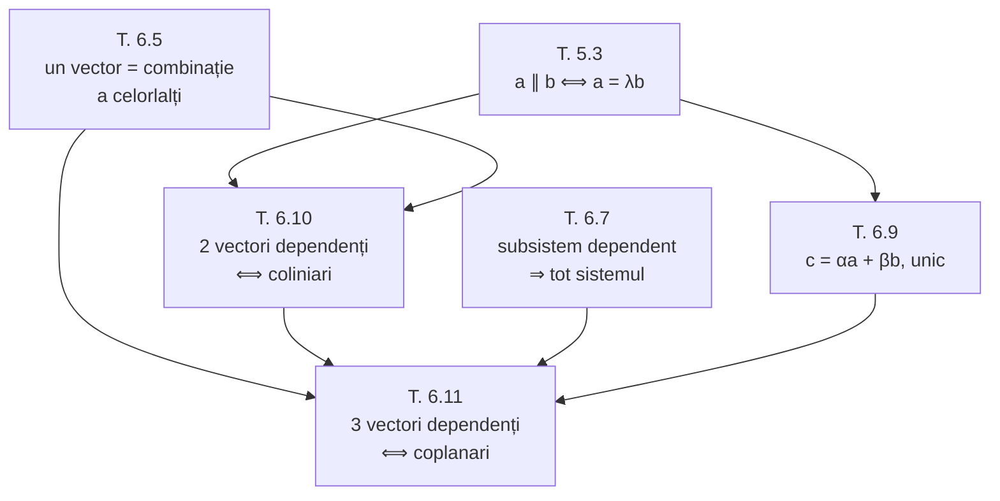

Cele două teoreme de mai jos sunt **inima capitolului**: ele traduc complet noțiunile geometrice (coliniar, coplanar) în noțiunea algebrică de dependență liniară.

## Teorema 6.10 — doi vectori

> [!tip] Teorema 6.10
> Sistemul format din **doi** vectori $\vec{a}$ și $\vec{b}$ este liniar dependent atunci și numai atunci, când acești vectori sunt **coliniari**.

*fig. 1 — $\vec{b} = 2\vec{a}$ dă combinația netrivială $2\vec{a} + (-1)\vec{b} = \vec{0}$*

**Demonstrație.**

**(⇒)** Să presupunem că sistemul format din vectorii $\vec{a}$ și $\vec{b}$ este liniar dependent. Atunci, conform [[Teoremele fundamentale ale dependenței liniare#Teorema 6.5 — caracterizarea dependenței|teoremei 6.5]], măcar unul din vectorii $\vec{a}$ sau $\vec{b}$ se exprimă liniar prin celălalt. Fie, de exemplu, $\vec{b} = \alpha\vec{a}$. Prin urmare, vectorii $\vec{a}$ și $\vec{b}$ sunt coliniari.

**(⇐)** Invers, fie că vectorii $\vec{a}$ și $\vec{b}$ sunt coliniari.

- Dacă $\vec{a} = \vec{0}$, atunci conform [[Teoremele fundamentale ale dependenței liniare#Teorema 6.6 — sistemele care conțin vectorul nul|teoremei 6.6]] sistemul format din $\vec{a}$ și $\vec{b}$ este liniar dependent.
- Dacă însă $\vec{a} \ne \vec{0}$, atunci în baza [[Raportul a doi vectori coliniari#3. Teorema 5.3 — criteriul de coliniaritate|teoremei despre vectori coliniari]] avem $\vec{b} = \alpha\vec{a}$. Prin urmare $\alpha\vec{a} + (-1)\vec{b} = \vec{0}$, ceea ce înseamnă că sistemul format din $\vec{a}$ și $\vec{b}$ este liniar dependent (coeficientul lui $\vec{b}$ este $-1 \ne 0$). $\blacksquare$

*fig. T1 — teorema 6.10: implicația directă și cele două cazuri ale reciprocei*

> [!example]- Cum se citește figura — teorema 6.10
> **Pasul 1 — panoul de sus (⇒).** Dependența dă, prin teorema 6.5, $\vec{b} = \alpha\vec{a}$; portocaliul $\vec{b} = 2\vec{a}$ se așază pe aceeași dreaptă punctată cu albastrul $\vec{a}$ — deci sunt coliniari.
>
> **Pasul 2 — panoul din mijloc (⇐, $\vec{a} = \vec{0}$).** Cercul albastru gol este $\vec{a} = \vec{0}$; $\vec{b}$ poate fi oricum. Combinația $1 \cdot \vec{a} + 0 \cdot \vec{b}$ este un punct, cu coeficientul $1 \ne 0$.
>
> **Pasul 3 — panoul de jos (⇐, $\vec{a} \ne \vec{0}$).** Teorema 5.3 dă $\vec{b} = \alpha\vec{a}$, aici cu $\alpha = 2$. Mergem $2\vec{a}$ (albastru) și ne întoarcem cu $(-1)\vec{b}$ (portocaliu): traseul revine în cercul violet, deci suma este $\vec{0}$.
>
> **Pasul 4 — de ce două cazuri la (⇐).** Teorema 5.3 cere vectori nenuli; pentru $\vec{a} = \vec{0}$ nu putem scrie $\vec{b}$ ca multiplu al lui $\vec{a}$, de aceea panoul din mijloc folosește teorema 6.6.
>
> **Pe ce se bazează:** [[Teoremele fundamentale ale dependenței liniare#Teorema 6.5 — caracterizarea dependenței|teorema 6.5]] (pasul 1); [[Teoremele fundamentale ale dependenței liniare#Teorema 6.6 — sistemele care conțin vectorul nul|teorema 6.6]] (pasul 2); [[Raportul a doi vectori coliniari#3. Teorema 5.3 — criteriul de coliniaritate|teorema 5.3]] (pasul 3); [[Combinație liniară. Dependență și independență liniară#2. Sistem liniar dependent|definiția 6.2]].
>
> **Ce să verificați singuri pe figură:** (1) în panoul de jos cele două săgeți au aceeași lungime și sensuri opuse; (2) înlocuiți în gând portocaliul cu o săgeată oblică: traseul nu se mai poate închide decât cu toți coeficienții nuli — vectorii necoliniari sunt independenți.

> [!note] De ce se tratează separat cazul $\vec{a} = \vec{0}$
> Teorema 5.3 cere vectori **nenuli**. Dacă $\vec{a} = \vec{0}$, nu putem scrie $\vec{b} = \alpha\vec{a}$ pentru $\vec{b} \ne \vec{0}$ — dar dependența rezultă gratuit din teorema 6.6.

## Teorema 6.11 — trei vectori

> [!tip] Teorema 6.11
> Sistemul format din **trei** vectori $\vec{a}$, $\vec{b}$ și $\vec{c}$ este liniar dependent atunci și numai atunci, când acești vectori sunt **coplanari**.

**Demonstrație.**

**(⇒)** Fie că sistemul format din vectorii $\vec{a}$, $\vec{b}$ și $\vec{c}$ este liniar dependent, adică

$$
\alpha\vec{a} + \beta\vec{b} + \gamma\vec{c} = \vec{0}, \qquad \text{unde } \alpha^2 + \beta^2 + \gamma^2 > 0.
$$

Să demonstrăm că vectorii $\vec{a}$, $\vec{b}$ și $\vec{c}$ sunt coplanari.

*Cazul degenerat.* Observăm că dacă măcar unul din numerele $\alpha$, $\beta$ sau $\gamma$ este egal cu zero, atunci afirmația este evidentă. Într-adevăr, fie de exemplu $\gamma = 0$; atunci $\alpha\vec{a} + \beta\vec{b} = \vec{0}$ și, conform teoremei 6.10, vectorii $\vec{a}$ și $\vec{b}$ sunt coliniari — prin urmare vectorii $\vec{a}$, $\vec{b}$ și $\vec{c}$ sunt coplanari.

*Cazul general.* Să cercetăm cazul când $\alpha \ne 0$, $\beta \ne 0$ și $\gamma \ne 0$. Depunem dintr-un punct oarecare $O$ vectorul $\vec{OA} = \alpha\vec{a}$, iar din punctul $A$ depunem vectorul $\vec{AB} = \beta\vec{b}$. Deoarece $\vec{OA} + \vec{AB} = \vec{OB}$, obținem

$$
\alpha\vec{a} + \beta\vec{b} = \vec{OB}.
$$

Însă $\alpha\vec{a} + \beta\vec{b} = -\gamma\vec{c}$ și, prin urmare, $\vec{OB} = -\gamma\vec{c}$.

Prin punctele $O$, $A$ și $B$ trece un plan $\pi$. Deoarece $\alpha \ne 0$, $\beta \ne 0$ și $\gamma \ne 0$, din egalitățile $\vec{OA} = \alpha\vec{a}$, $\vec{AB} = \beta\vec{b}$ și $\vec{OB} = -\gamma\vec{c}$ urmează că vectorii $\vec{a}$, $\vec{b}$ și $\vec{c}$ sunt paraleli planului $\pi$ și, prin urmare, acești vectori sunt coplanari.

**(⇐)** Invers, fie că vectorii $\vec{a}$, $\vec{b}$ și $\vec{c}$ sunt coplanari.

- Dacă $\vec{a} \parallel \vec{b}$, atunci conform teoremei 6.10 vectorii $\vec{a}$ și $\vec{b}$ sunt liniar dependenți și, în baza [[Teoremele fundamentale ale dependenței liniare#Teorema 6.7 — dependența se moștenește în sus|teoremei 6.7]], sistemul format din $\vec{a}$, $\vec{b}$ și $\vec{c}$ este liniar dependent.
- Dacă însă vectorii $\vec{a}$ și $\vec{b}$ nu-s coliniari, atunci în baza [[Descompunerea unui vector după doi vectori necoliniari|teoremei despre vectorii coplanari (6.9)]] avem $\vec{c} = \alpha\vec{a} + \beta\vec{b}$ și, conform teoremei 6.5, sistemul este liniar dependent. $\blacksquare$

*fig. T2 — teorema 6.11: cazul general al implicației directe și cele două cazuri ale reciprocei*

> [!example]- Cum se citește figura — teorema 6.11
> **Pasul 1 — sus, traseul.** Din $O$: $\alpha\vec{a}$ (albastru) până în $A$, apoi $\beta\vec{b}$ (portocaliu) până în $B$. Verdele $\vec{OB}$ închide triunghiul; din ipoteză el este $-\gamma\vec{c}$.
>
> **Pasul 2 — planul $\pi$.** Punctele $O$, $A$, $B$ determină planul gri $\pi$, iar toate trei laturile sunt în el.
>
> **Pasul 3 — de la laturi la vectori.** Fiecare latură este un multiplu **nenul** al unui vector din sistem, deci are direcția lui: $\vec{a}$, $\vec{b}$, $\vec{c}$ sunt paraleli cu $\pi$, adică coplanari.
>
> **Pasul 4 — jos stânga (⇐, $\vec{a} \parallel \vec{b}$).** Albastrul și portocaliul sunt pe aceeași dreaptă: $\{\vec{a}, \vec{b}\}$ este dependent (T. 6.10), iar adăugarea verdelui $\vec{c}$ nu strică dependența (T. 6.7).
>
> **Pasul 5 — jos dreapta (⇐, $\vec{a} \nparallel \vec{b}$).** Verdele $\vec{c}$ se descompune pe drumul punctat $2\vec{a}$, apoi $2\vec{b}$ (T. 6.9); un vector fiind combinație a celorlalți, sistemul este dependent (T. 6.5).
>
> **Pe ce se bazează:** [[Adunarea vectorilor. Regula triunghiului și a poligonului#2. Regula triunghiului|regula triunghiului]] (pasul 1); [[Vectori coplanari#2. Definiția coplanarității|definiția coplanarității]] (pașii 2–3); [[Produsul vectorului la un număr#1. Definiția|definiția 5.1]] — înmulțirea cu un număr nenul păstrează direcția (pasul 3); teoremele [[#Teorema 6.10 — doi vectori|6.10]], [[Teoremele fundamentale ale dependenței liniare#Teorema 6.7 — dependența se moștenește în sus|6.7]], [[Descompunerea unui vector după doi vectori necoliniari|6.9]] și [[Teoremele fundamentale ale dependenței liniare#Teorema 6.5 — caracterizarea dependenței|6.5]] (pașii 4–5).
>
> **Ce să verificați singuri pe figură:** (1) sus, traseul $O \to A \to B \to O$ se închide: $\alpha\vec{a} + \beta\vec{b} + \gamma\vec{c} = \vec{0}$, pentru că $\vec{BO} = \gamma\vec{c}$; (2) dacă $\alpha$ ar fi $0$, $A$ ar coincide cu $O$ și latura albastră ar dispărea — n-am mai afla nimic despre direcția lui $\vec{a}$ (avertismentul de mai jos).

> [!warning] Detaliu fin în cazul general
> Faptul că $\alpha \ne 0$ este necesar pentru a trece de la „$\vec{OA} = \alpha\vec{a}$ este în planul $\pi$" la „$\vec{a}$ este paralel cu $\pi$". Dacă $\alpha$ ar fi $0$, atunci $\vec{OA} = \vec{0}$ nu ar spune nimic despre direcția lui $\vec{a}$.

> [!example]- Pas cu pas — cazul general al teoremei 6.11
> Datele: $\alpha\vec{a} + \beta\vec{b} + \gamma\vec{c} = \vec{0}$, cu **toți** coeficienții nenuli. Ținta: cei trei vectori sunt paraleli cu un același plan.
>
> **Pasul 1 — de ce nu desenăm direct $\vec{a}$, $\vec{b}$, $\vec{c}$.** Pentru că relația pe care o avem îi conține *înmulțiți cu coeficienți*. Desenăm deci vectorii care apar efectiv în relație.
>
> **Pasul 2 — construim traseul.** Din $O$ punem $\vec{OA} = \alpha\vec{a}$; din $A$ punem $\vec{AB} = \beta\vec{b}$. Prin regula triunghiului: $\vec{OB} = \alpha\vec{a} + \beta\vec{b}$.
>
> **Pasul 3 — folosim ipoteza.** Din relația dată, $\alpha\vec{a} + \beta\vec{b} = -\gamma\vec{c}$. Deci $\vec{OB} = -\gamma\vec{c}$. Al treilea vector a apărut singur în desen — nu l-am construit, l-a adus relația.
>
> **Pasul 4 — luăm planul.** Prin trei puncte $O$, $A$, $B$ trece un plan $\pi$. Toate cele trei segmente $\vec{OA}$, $\vec{AB}$, $\vec{OB}$ sunt în $\pi$, deci paralele cu $\pi$.
>
> **Pasul 5 — coborâm coeficienții.** $\vec{OA} = \alpha\vec{a} \parallel \pi$ și $\alpha \ne 0$ ⇒ $\vec{a} \parallel \pi$ (înmulțirea cu un număr nenul **nu schimbă direcția**). La fel pentru $\vec{b}$ din $\beta \ne 0$ și pentru $\vec{c}$ din $\gamma \ne 0$.
>
> **Pasul 6 — concluzia.** Toți trei sunt paraleli cu $\pi$, deci coplanari. $\blacksquare$
>
> **Ideea de reținut.** O relație algebrică între vectori a fost *transformată într-o figură*: fiecare termen a devenit o latură a unui traseu închis. Acesta e mecanismul care se repetă în tot capitolul.

## Tabloul complet

| Număr de vectori | Liniar dependent ⟺ | Liniar independent ⟺ |
|---|---|---|
| 1 | $\vec{a} = \vec{0}$ | $\vec{a} \ne \vec{0}$ |
| 2 | coliniari | necoliniari |
| 3 | coplanari | necoplanari |
| 4 sau mai mulți | **întotdeauna** | imposibil |

> [!info]- Completare — de ce patru vectori sunt mereu dependenți
> În spațiul cu trei dimensiuni, orice vector se descompune după trei vectori necoplanari (analogul spațial al teoremei 6.9). Al patrulea vector este atunci o combinație liniară a celorlalți trei, deci sistemul e dependent după teorema 6.5. Aceasta înseamnă că **dimensiunea spațiului vectorilor liberi este 3** — vezi [[Spațiul vectorial al vectorilor liberi]]. Rezultatul nu figurează încă în notițele de curs.

## Întrebări de control

1. Sunt vectorii $\vec{a}$, $\vec{0}$, $\vec{b}$ liniar dependenți? Sunt ei coplanari?
2. Trei vectori necoplanari pot conține doi vectori coliniari?
3. Folosind teorema 6.11, arătați că patru puncte $A$, $B$, $C$, $D$ sunt coplanare dacă și numai dacă $\vec{AB}$, $\vec{AC}$, $\vec{AD}$ sunt liniar dependenți.
4. De ce implicația „coplanari ⇒ dependenți" necesită două cazuri?
5. Formulați analogul teoremei 6.10 și 6.11 pentru un singur vector.

## Legături

- Anterior: [[Descompunerea unui vector după doi vectori necoliniari]]
- Continuare: [[Spațiul vectorial al vectorilor liberi]]
- Concepte: [[Vectori coliniari]], [[Coplanaritate]], [[Dependență liniară]]
