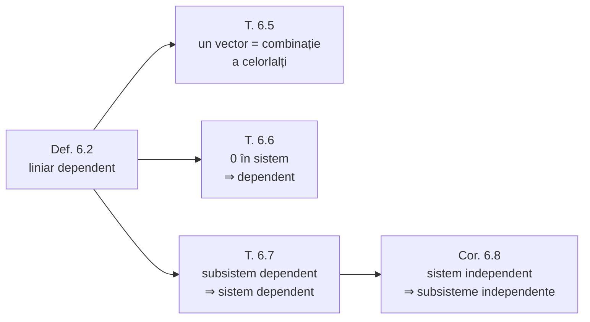

## Teorema 6.5 — caracterizarea dependenței

> [!tip] Teorema 6.5
> Sistemul $\sigma$ este liniar dependent atunci și numai atunci, când **cel puțin unul din vectorii acestui sistem este o combinație liniară a celorlalți** vectori ai sistemului $\sigma$.

> [!note] De ce contează
> Aceasta este traducerea intuitivă a definiției: „liniar dependent" = **un vector este de prisos**, pentru că poate fi reconstruit din ceilalți.

**Demonstrație.**

**Necesitatea.** Fie sistemul $\sigma$ liniar dependent și $n > 1$. Atunci are loc (2) cu condiția (3). Fără a ieși din comun, presupunem că $\alpha_1 \ne 0$. Atunci din (2) putem scrie:

$$
\alpha_1\vec{a}_1 = -\alpha_2\vec{a}_2 - \alpha_3\vec{a}_3 - \dots - \alpha_n\vec{a}_n
$$

și, împărțind la $\alpha_1$:

$$
\vec{a}_1 = -\frac{\alpha_2}{\alpha_1}\vec{a}_2 - \frac{\alpha_3}{\alpha_1}\vec{a}_3 - \dots - \frac{\alpha_n}{\alpha_1}\vec{a}_n
$$

Notăm $-\dfrac{\alpha_i}{\alpha_1} = \beta_i$ $(i = 2, 3, \dots, n)$. Atunci

$$
\vec{a}_1 = \beta_2\vec{a}_2 + \beta_3\vec{a}_3 + \dots + \beta_n\vec{a}_n \tag{4}
$$

Deci vectorul $\vec{a}_1$ (ales după coeficientul $\alpha_1 \ne 0$) este o combinație liniară a celorlalți vectori ai sistemului $\sigma$.

> [!example]- Pas cu pas — necesitatea, cu un exemplu numeric
> Fie $3\vec{a}_1 + 6\vec{a}_2 - 9\vec{a}_3 = \vec{0}$ (coeficienți: $3$, $6$, $-9$ — nu toți nuli, deci sistem dependent).
>
> **Pasul 1 — alegem un coeficient nenul.** Aici $\alpha_1 = 3 \ne 0$. *(Am fi putut alege oricare dintre ei — de aceea teorema spune „cel puțin unul".)*
>
> **Pasul 2 — izolăm termenul ales.** Trecem restul în dreapta:
> $$
> 3\vec{a}_1 = -6\vec{a}_2 + 9\vec{a}_3
> $$
>
> **Pasul 3 — împărțim la coeficientul ales.** Aici e singurul loc unde avem nevoie de $\alpha_1 \ne 0$:
> $$
> \vec{a}_1 = -2\vec{a}_2 + 3\vec{a}_3
> $$
>
> **Pasul 4 — botezăm coeficienții noi.** În demonstrația generală se notează $\beta_i = -\dfrac{\alpha_i}{\alpha_1}$; aici $\beta_2 = -2$, $\beta_3 = 3$. Notația nu schimbă nimic, doar face formula lizibilă.
>
> **Pasul 5 — citim rezultatul.** $\vec{a}_1$ **este** o combinație liniară a celorlalți. Exact ce trebuia arătat.
>
> **Sensul invers (suficiența)** face aceiași pași, dar în ordine inversă: pornim de la $\vec{a}_1 = \beta_2\vec{a}_2 + \beta_3\vec{a}_3$, mutăm totul în stânga și obținem $(-1)\vec{a}_1 + \beta_2\vec{a}_2 + \beta_3\vec{a}_3 = \vec{0}$. Coeficientul $-1$ este *garantat* nenul — de aceea combinația e netrivială, indiferent cât sunt $\beta_i$.

**Suficiența.** Fie unul din vectorii sistemului $\sigma$, de exemplu $\vec{a}_1$, este o combinație liniară a celorlalți vectori. Atunci există numerele $\beta_2, \beta_3, \dots, \beta_n$ încât are loc (4). Notăm $\alpha_1 = -1$, $\alpha_i = \beta_i$ $(i = 2, 3, \dots, n)$. Din (4) rezultă că

$$
\alpha_1\vec{a}_1 + \alpha_2\vec{a}_2 + \alpha_3\vec{a}_3 + \dots + \alpha_n\vec{a}_n = \vec{0}
$$

și cel puțin $\alpha_1 \ne 0$. Prin urmare sistemul de vectori $\sigma$ este liniar dependent. $\blacksquare$

*fig. T1 — teorema 6.5 pe exemplul $3\vec{a}_1 + 6\vec{a}_2 - 9\vec{a}_3 = \vec{0}$*

> [!example]- Cum se citește figura — teorema 6.5
> **Pasul 1 — stânga, ipoteza.** Termenii relației sunt desenați cap la cap: violet $3\vec{a}_1$, albastru $6\vec{a}_2$, portocaliu $-9\vec{a}_3$. Traseul revine în punctul de plecare — asta înseamnă „$= \vec{0}$”.
>
> **Pasul 2 — alegem termenul de izolat.** Coeficientul lui $\vec{a}_1$ este $3 \ne 0$, deci putem împărți la el. Latura violet este cea care se va exprima prin celelalte.
>
> **Pasul 3 — dreapta, după izolare.** Același triunghi: violetul (la aceeași scară) a rămas neschimbat, iar albastrul și portocaliul sunt parcurse **în sens invers** — au trecut în partea cealaltă a egalității, cu semn schimbat. Împărțind la $3$: $\vec{a}_1 = -2\vec{a}_2 + 3\vec{a}_3$, iar violetul devine latura de închidere.
>
> **Pasul 4 — sensul invers (suficiența).** Citiți dreapta pornind de la formulă: din $\vec{a}_1 = -2\vec{a}_2 + 3\vec{a}_3$ trecem $\vec{a}_1$ în stânga cu coeficientul $-1$ și traseul se închide din nou; coeficientul $-1 \ne 0$ face combinația netrivială.
>
> **Pe ce se bazează:** [[Combinație liniară. Dependență și independență liniară#2. Sistem liniar dependent|definiția 6.2]]; [[Adunarea vectorilor. Regula triunghiului și a poligonului#1. Construcția sumei|regula poligonului]] — traseu închis ⟺ sumă nulă; [[Proprietățile înmulțirii vectorului cu un număr]] (împărțirea la $3$, mutarea termenilor).
>
> **Ce să verificați singuri pe figură:** (1) comparați panourile: violetul e identic, albastrul și portocaliul au aceleași lungimi, dar săgețile întoarse; (2) dacă coeficientul lui $\vec{a}_1$ ar fi fost $0$, latura violet ar lipsi din stânga și n-ar avea ce izola.

> [!warning] Atenție: „cel puțin unul", nu „oricare"
> Teorema nu spune că *fiecare* vector al unui sistem dependent se exprimă prin ceilalți — doar că *măcar unul* o face. În demonstrație, vectorul care se poate izola este exact cel cu **coeficient nenul**.
>
> Exemplu: în sistemul $\{\vec{a}, 2\vec{a}, \vec{b}\}$ cu $\vec{b}$ necoliniar cu $\vec{a}$, vectorul $\vec{b}$ **nu** se exprimă prin ceilalți doi, deși sistemul este dependent.

## Teorema 6.6 — sistemele care conțin vectorul nul

> [!tip] Teorema 6.6
> Dacă vectorul $\vec{0} \in \sigma$, atunci sistemul $\sigma$ este liniar dependent.

**Demonstrație.** Fie $\vec{0} \in \sigma$ și $n > 1$. Din nou putem presupune că $\vec{a}_1 = \vec{0}$. Luăm $\alpha_1 \ne 0$, iar $\alpha_2 = \alpha_3 = \dots = \alpha_n = 0$. Atunci

$$
\alpha_1\vec{a}_1 + \alpha_2\vec{a}_2 + \dots + \alpha_n\vec{a}_n = \alpha_1\vec{0} = \vec{0} \qquad \text{și} \qquad \sum_{i=1}^{n} \alpha_i^2 \ne 0.
$$

Deci sistemul $\sigma$ este liniar dependent. $\blacksquare$

*fig. T2 — teorema 6.6: coeficientul nenul „se pune” pe vectorul nul*

> [!example]- Cum se citește figura — teorema 6.6
> **Pasul 1 — sus, sistemul.** $\vec{a}_1 = \vec{0}$ (cercul portocaliu gol), $\vec{a}_2$ (albastru), $\vec{a}_3$ (verde) — ultimii doi pot fi oricum.
>
> **Pasul 2 — alegem coeficienții.** Coeficientul nenul ($1$) îl primește vectorul nul; vectorii „adevărați” primesc $0$.
>
> **Pasul 3 — jos, fiecare termen.** Toți trei devin puncte: $1 \cdot \vec{0} = \vec{0}$, pentru că $\alpha\vec{0} = \vec{0}$; iar $0 \cdot \vec{a}_2 = 0 \cdot \vec{a}_3 = \vec{0}$, pentru că $0 \cdot \vec{a} = \vec{0}$.
>
> **Pasul 4 — concluzia.** Suma este $\vec{0}$, iar suma pătratelor coeficienților este $1 \ne 0$: combinația e netrivială, deci sistemul e dependent.
>
> **Pe ce se bazează:** [[Produsul vectorului la un număr#2. Cazuri particulare evidente|cazurile particulare ale înmulțirii cu un număr]]; [[Combinație liniară. Dependență și independență liniară#2. Sistem liniar dependent|definiția 6.2 și nota 6.3]].
>
> **Ce să verificați singuri pe figură:** (1) rotiți în gând $\vec{a}_2$ și $\vec{a}_3$ oricum: rândul de jos nu se schimbă; (2) dați coeficientul nenul lui $\vec{a}_2$ în loc de $\vec{a}_1$: termenul lui n-ar mai fi un punct.

> [!check] Test rapid
> **Vezi $\vec{0}$ în sistem ⇒ sistemul e dependent.** Nu mai e nevoie de niciun calcul.

## Teorema 6.7 — dependența se moștenește în sus

> [!tip] Teorema 6.7
> Dacă un subsistem $\sigma'$ al sistemului $\sigma$ este liniar dependent, atunci și întreg sistemul $\sigma$ este liniar dependent.

**Demonstrație.** Fie $\sigma' = \{\vec{a}_1, \vec{a}_2, \dots, \vec{a}_k\}$, unde $k < n$, liniar dependent. Prin urmare există $\alpha_1, \alpha_2, \dots, \alpha_k$ astfel încât

$$
\sum_{i=1}^{k} \alpha_i^2 \ne 0 \qquad \text{și} \qquad \alpha_1\vec{a}_1 + \alpha_2\vec{a}_2 + \dots + \alpha_k\vec{a}_k = \vec{0}.
$$

Luăm $\alpha_{k+1} = \alpha_{k+2} = \dots = \alpha_n = 0$ și obținem:

$$
\alpha_1\vec{a}_1 + \alpha_2\vec{a}_2 + \dots + \alpha_k\vec{a}_k + \alpha_{k+1}\vec{a}_{k+1} + \dots + \alpha_n\vec{a}_n = \vec{0} \qquad \text{și} \qquad \sum_{i=1}^{n} \alpha_i^2 \ne 0.
$$

Așadar sistemul $\sigma$ este liniar dependent. $\blacksquare$

*fig. T3 — teorema 6.7: vectorul adăugat primește coeficientul $0$*

> [!example]- Cum se citește figura — teorema 6.7
> **Pasul 1 — stânga sus, subsistemul.** $\sigma' = \{\vec{a}, \vec{b}\}$ cu $\vec{b} = 2\vec{a}$: săgeata portocalie este de două ori albastra.
>
> **Pasul 2 — stânga jos, dependența lui $\sigma'$.** $2\vec{a}$ (albastru, dus) urmat de $(-1)\vec{b}$ (portocaliu, întors) revine în punctul de plecare (cercul violet): $2\vec{a} + (-1)\vec{b} = \vec{0}$.
>
> **Pasul 3 — dreapta, sistemul mare.** Se adaugă $\vec{c}$ (verde), oarecare. Primind coeficientul $0$, termenul $0 \cdot \vec{c}$ este doar un punct (cercul verde mic) și nu adaugă nicio latură traseului.
>
> **Pasul 4 — concluzia.** Traseul din dreapta este identic cu cel din stânga și se închide la fel; coeficienții $2$, $-1$, $0$ nu sunt toți nuli, deci $\sigma$ este dependent.
>
> **Pe ce se bazează:** [[Combinație liniară. Dependență și independență liniară#2. Sistem liniar dependent|definiția 6.2]]; $0 \cdot \vec{c} = \vec{0}$ și [[Adunarea vectorilor. Regula triunghiului și a poligonului#Consecința 1 — vectorul nul este element neutru|elementul neutru]] al adunării.
>
> **Ce să verificați singuri pe figură:** (1) oricâți vectori verzi ați adăuga, fiecare cu coeficientul $0$, traseul rămâne cel din stânga; (2) figura nu merge invers: scoțând $\vec{b}$ din $\sigma'$ rămâne $\{\vec{a}\}$, care e independent — vezi întrebarea 4.

> [!tip] Ideea: „completare cu zerouri"
> Relația care dovedea dependența subsistemului rămâne valabilă în sistemul mare, dacă dăm coeficientul $0$ vectorilor adăugați. Suma de pătrate rămâne nenulă, pentru că termenii nenuli erau deja acolo.

## Corolarul 6.8 — independența se moștenește în jos

> [!check] Corolarul 6.8
> Dacă sistemul $\sigma$ este liniar independent, atunci și **orice subsistem** al lui este liniar independent.

> [!info]- De ce este doar contrapoziția teoremei 6.7
> Teorema 6.7 spune: *subsistem dependent ⇒ sistem dependent*. Negând ambele părți și inversând implicația: *sistem independent ⇒ orice subsistem independent*. Nu e nevoie de o demonstrație nouă.

*fig. T4 — corolarul 6.8: subsistemele unui sistem independent*

> [!example]- Cum se citește figura — corolarul 6.8
> **Pasul 1 — stânga, sistemul mare.** $\vec{a}$ (albastru), $\vec{b}$ (portocaliu, spre privitor) și $\vec{c}$ (verde, în sus), din același punct $O$, sunt necoplanari — deci $\sigma$ este independent (teorema 6.11).
>
> **Pasul 2 — planele colorate.** Umbra albastră este planul lui $\vec{a}$ și $\vec{b}$, umbra verde — planul lui $\vec{a}$ și $\vec{c}$. Fiecare pereche determină un plan, deci nicio pereche nu e coliniară.
>
> **Pasul 3 — dreapta, lista subsistemelor.** Perechile sunt necoliniare (teorema 6.10), vectorii singuri sunt nenuli — toate subsistemele sunt independente.
>
> **Pasul 4 — mecanismul logic (roșu).** Nu e nevoie să verificăm subsistem cu subsistem: dacă vreunul ar fi dependent, teorema 6.7 ar face tot $\sigma$ dependent, contrazicând pasul 1.
>
> **Pe ce se bazează:** [[#Teorema 6.7 — dependența se moștenește în sus|teorema 6.7]], prin contrapoziție (pasul 4); [[Coliniaritate, coplanaritate și dependență liniară#Teorema 6.11 — trei vectori|teorema 6.11]] și [[Coliniaritate, coplanaritate și dependență liniară#Teorema 6.10 — doi vectori|teorema 6.10]] (pașii 1–3); [[Combinație liniară. Dependență și independență liniară#4. Cazul unui singur vector|cazul unui singur vector]].
>
> **Ce să verificați singuri pe figură:** (1) culcați în gând $\vec{c}$ în planul albastru: $\sigma$ devine dependent, dar $\{\vec{a}, \vec{b}\}$ rămâne independent — reciproca corolarului e falsă; (2) numărați subsistemele nevide proprii: $3$ perechi și $3$ vectori singuri.

## Rezumat: cele patru rezultate

## Întrebări de control

1. În demonstrația teoremei 6.5, de ce este esențial ca $\alpha_1 \ne 0$?
2. Dați un exemplu de sistem liniar dependent în care un anumit vector **nu** se exprimă prin ceilalți.
3. Poate un sistem liniar independent să conțină doi vectori egali?
4. Este adevărat reciproc la teorema 6.7 — dacă $\sigma$ e dependent, orice subsistem al lui este dependent?
5. Ce sisteme de un singur vector sunt liniar independente?

## Legături

- Anterior: [[Combinație liniară. Dependență și independență liniară]]
- Continuare: [[Vectori coplanari]]
- Vezi și: [[Coliniaritate, coplanaritate și dependență liniară]]
