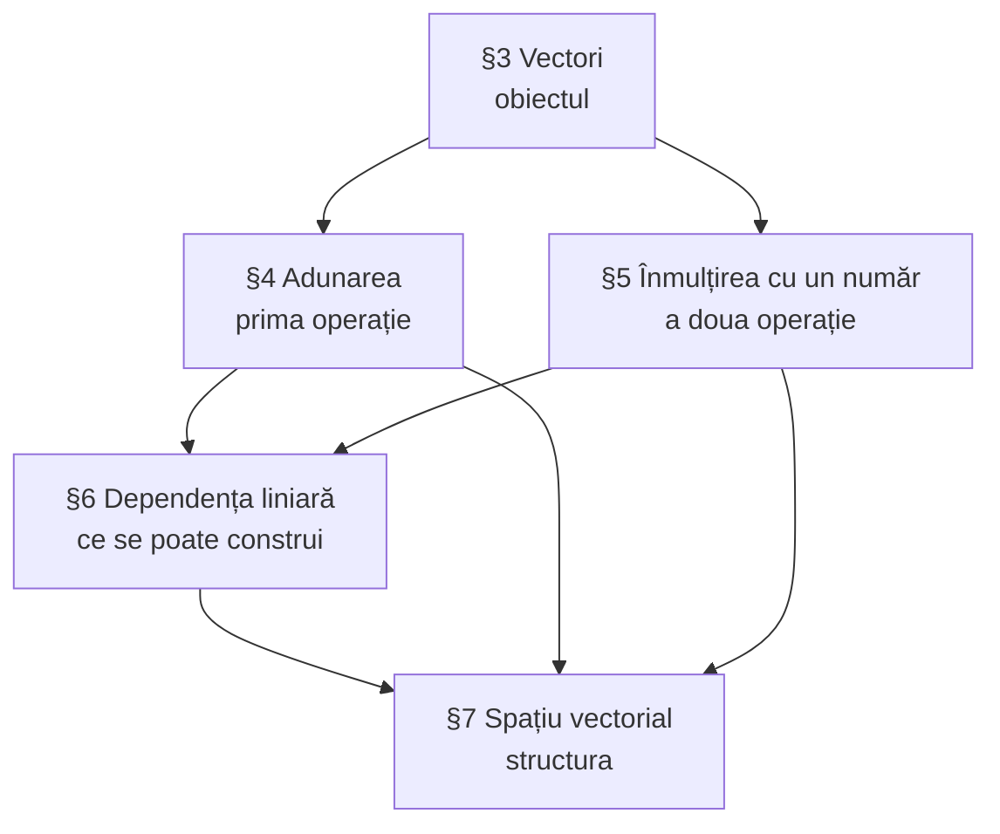

## 1. Cele opt proprietăți

Să notăm prin $V$ **mulțimea tuturor vectorilor**. Am definit pe această mulțime operația de [[Adunarea vectorilor. Regula triunghiului și a poligonului|adunare a vectorilor]] și operația de [[Produsul vectorului la un număr|înmulțire a vectorului la un număr]]. Am demonstrat că, în raport cu aceste operații, se satisfac următoarele proprietăți:

| # | Proprietate | Enunț |
|---|---|---|
| 1 | comutativitate | $\vec{a} + \vec{b} = \vec{b} + \vec{a}$, pentru orice $\vec{a}, \vec{b} \in V$ |
| 2 | asociativitate | $\vec{a} + (\vec{b} + \vec{c}) = (\vec{a} + \vec{b}) + \vec{c}$, pentru orice $\vec{a}, \vec{b}, \vec{c} \in V$ |
| 3 | element neutru | există $\vec{0} \in V$ astfel încât $\vec{a} + \vec{0} = \vec{0} + \vec{a} = \vec{a}$, pentru orice $\vec{a} \in V$ |
| 4 | element opus | pentru orice $\vec{a} \in V$ există $(-\vec{a}) \in V$ încât $\vec{a} + (-\vec{a}) = (-\vec{a}) + \vec{a} = \vec{0}$ |
| 5 | unitatea scalară | $1 \cdot \vec{a} = \vec{a}$, pentru orice $\vec{a} \in V$ |
| 6 | asociativitate mixtă | $\beta(\alpha\vec{a}) = (\beta\alpha)\vec{a}$, pentru orice $\vec{a} \in V$ și orice $\alpha, \beta \in \mathbb{R}$ |
| 7 | distributivitate față de vectori | $\alpha(\vec{a} + \vec{b}) = \alpha\vec{a} + \alpha\vec{b}$, pentru orice $\alpha \in \mathbb{R}$ și orice $\vec{a}, \vec{b} \in V$ |
| 8 | distributivitate față de scalari | $(\alpha + \beta)\vec{a} = \alpha\vec{a} + \beta\vec{a}$, pentru orice $\vec{a} \in V$ și orice $\alpha, \beta \in \mathbb{R}$ |

> [!tip] Concluzia paragrafului
> Comparând aceste proprietăți cu definiția **spațiului vectorial**, cunoscută din algebră, ne convingem că mulțimea $V$ a tuturor vectorilor din spațiu formează **spațiu vectorial liniar** (peste $\mathbb{R}$).

> [!note] Ce s-a câștigat
> Nimic nou nu s-a demonstrat aici — s-au **strâns la un loc** rezultatele din §4 și §5. Câștigul e conceptual: de acum înainte, orice teoremă generală de algebră liniară (despre baze, dimensiune, coordonate) se aplică automat vectorilor din spațiu, fără a mai reface demonstrațiile geometric.
>
> Unde a fost demonstrată fiecare proprietate:
> - 1–4 → [[Proprietățile adunării vectorilor]]
> - 5 → [[Produsul vectorului la un număr#2. Cazuri particulare evidente|Produsul vectorului la un număr]]
> - 6–8 → [[Proprietățile înmulțirii vectorului cu un număr]]

## 2. Subspațiu vectorial

Fie $L$ o submulțime nevidă de vectori a spațiului vectorial $V$.

> [!abstract] Definiție
> Mulțimea $L$ se numește **subspațiu vectorial** al spațiului $V$, dacă se satisfac condițiile:
>
> 1. Dacă $\vec{a} \in L$ și $\vec{b} \in L$, atunci $\vec{a} + \vec{b} \in L$;
> 2. Dacă $\vec{a} \in L$, atunci $\alpha\vec{a} \in L$ pentru orice număr real $\alpha$.

> [!tip] Cum se citesc condițiile
> Un subspațiu este o parte din care **nu se poate ieși** prin cele două operații: aduni doi vectori din $L$ — rămâi în $L$; înmulțești cu orice număr — rămâi în $L$. Se spune că $L$ este *închisă* față de operații.
>
> Observați că din condiția 2 cu $\alpha = 0$ rezultă $\vec{0} \in L$: **orice subspațiu conține vectorul nul**.

## 3. Exemple

*fig. 1 — lanțul de subspații $\{\vec{0}\} \subset V_1 \subset V_2 \subset V$*

> [!example] Exemplul 7.1 — subspațiul nul
> Fie $W = \{\vec{0}\}$ (mulțimea $W$ constă numai din vectorul nul). Mulțimea $W$ este spațiu vectorial.

> [!example] Exemplul 7.2 — vectorii unei drepte
> Notăm prin $V_1$ mulțimea vectorilor coliniari (situați pe o dreaptă). Evident, $V_1 \subset V$. Ușor ne convingem că $V_1$ este subspațiu al spațiului $V$.
>
> *Precizare:* dreapta trebuie **fixată** — $V_1$ = toți vectorii paraleli cu o dreaptă dată $d$. Mulțimea „tuturor vectorilor coliniari cu ceva" nu e bine definită, iar doi vectori de pe drepte diferite au o sumă care iese de pe ambele direcții.

> [!example] Exemplul 7.3 — vectorii unui plan
> Notăm prin $V_2$ mulțimea vectorilor coplanari (situați în același plan). Ușor ne convingem că $V_2$ este subspațiu al spațiului $V$.
>
> *Precizare:* analog, planul se **fixează** — $V_2$ = toți vectorii paraleli cu un plan dat $\pi$ (exact „sistemul de vectori coplanari" din [[Spațiul V2. Vectori coplanari și dimensiunea planului|§9]]).

> [!example]- Cum se citește figura — exemplele 7.1–7.3 (fig. 1)
> **Pasul 1 — punctul portocaliu.** Originea comună și singurul element al lui $W = \{\vec{0}\}$. Adunând sau înmulțind $\vec{0}$ obținem tot $\vec{0}$ — exemplul 7.1.
>
> **Pasul 2 — dreapta și săgeata albastră ($V_1$).** Vectorii paraleli cu o dreaptă dată, depuși din origine. Suma a doi astfel de vectori și orice multiplu $\alpha\vec{a}$ rămân pe dreaptă — exemplul 7.2.
>
> **Pasul 3 — planul și săgeata verde ($V_2$).** Vectorii paraleli cu un plan dat. Diagonala paralelogramului construit pe doi vectori din plan este tot în plan, iar $\alpha\vec{a}$ păstrează direcția lui $\vec{a}$ — exemplul 7.3.
>
> **Pasul 4 — lanțul.** Punctul e pe dreaptă, dreapta e în plan, planul e în spațiu: $\{\vec{0}\} \subset V_1 \subset V_2 \subset V$. Fiecare treaptă conține vectorul nul, cum cere orice subspațiu.
>
> **Pe ce se bazează:** [[#2. Subspațiu vectorial|condițiile 1) și 2)]]; [[Regula paralelogramului]] (închiderea față de adunare); [[Produsul vectorului la un număr#1. Definiția|definiția 5.1]] (închiderea față de înmulțire); [[Vectori coplanari]].
>
> **Ce să verificați singuri pe figură:** (1) suma a doi vectori din planul figurii nu poate „ieși” în sus din plan — diagonala rămâne în plan; (2) vectorii de modul cel mult $1$ (un disc în jurul punctului portocaliu) nu formează subspațiu: dublul unui vector de modul $1$ iese din disc (întrebarea 2).

## 4. Exemplul 7.4 — acoperirea liniară $L(\vec{a}, \vec{b})$

> [!example] Exemplul 7.4
> Fie $\vec{a}, \vec{b} \in V$ doi vectori **necoliniari**. Considerăm mulțimea tuturor vectorilor de forma $\alpha\vec{a} + \beta\vec{b}$, unde $\alpha$ și $\beta$ sunt numere reale arbitrare. Această mulțime satisface condițiilor 1) și 2) și, prin urmare, este un subspațiu al spațiului $V$. Acest spațiu se notează de obicei prin $L(\vec{a}, \vec{b})$.

**Afirmație.** Fie $\pi$ un plan paralel cu vectorii $\vec{a}$ și $\vec{b}$. Atunci $L(\vec{a}, \vec{b})$ este mulțimea acelor și numai acelor vectori ai spațiului $V$ care sunt paraleli cu planul $\pi$.

**Demonstrație.**

**(⊆)** Pentru orice valori $\alpha$ și $\beta$, vectorii $\vec{p} = \alpha\vec{a} + \beta\vec{b}$, $\vec{a}$ și $\vec{b}$ sunt liniar dependenți și deci **coplanari** ([[Coliniaritate, coplanaritate și dependență liniară#Teorema 6.11 — trei vectori|teorema 6.11]]), dar atunci $\vec{p} \parallel \pi$.

**(⊇)** Invers, orice vector $\vec{p} \parallel \pi$ este coplanar cu vectorii $\vec{a}$ și $\vec{b}$ și, prin urmare, este o combinație liniară a vectorilor $\vec{a}$ și $\vec{b}$ ([[Descompunerea unui vector după doi vectori necoliniari|teorema 6.9]]). $\blacksquare$

*fig. T1 — exemplul 7.4: cele două incluziuni, $L(\vec{a}, \vec{b}) \subseteq$ și $\supseteq$ vectorii paraleli cu $\pi$*

> [!example]- Cum se citește figura — exemplul 7.4
> **Pasul 1 — stânga, datele.** În planul gri $\pi$: $\vec{a}$ (albastru) și $\vec{b}$ (portocaliu), necoliniari, din $O$.
>
> **Pasul 2 — stânga, incluziunea (⊆).** O combinație $\vec{p} = \alpha\vec{a} + \beta\vec{b}$ se construiește cap la cap (punctat): $1{,}5\vec{a}$, apoi $1{,}2\vec{b}$. Violetul $\vec{p}$ rămâne în $\pi$ — teorema 6.11: $\vec{a}$, $\vec{b}$, $\vec{p}$ dependenți ⇒ coplanari.
>
> **Pasul 3 — stânga, contraexemplul (roșu).** $\vec{q}$ iese din plan; nicio alegere a lui $\alpha$ și $\beta$ nu îl poate produce, deci $\vec{q} \notin L(\vec{a}, \vec{b})$.
>
> **Pasul 4 — dreapta, incluziunea (⊇).** Acum $\vec{p}$ (violet) este dat, paralel cu $\pi$. Prin vârful lui se duce paralela gri la $\vec{b}$ până la dreapta lui $\vec{a}$; bucățile punctate sunt $\alpha\vec{a}$ și $\beta\vec{b}$ — teorema 6.9.
>
> **Pasul 5 — concluzia.** Stânga: tot ce generează $\vec{a}$ și $\vec{b}$ e în $\pi$. Dreapta: tot ce e paralel cu $\pi$ este generat. Deci $L(\vec{a}, \vec{b})$ este exact mulțimea vectorilor paraleli cu $\pi$.
>
> **Pe ce se bazează:** [[Coliniaritate, coplanaritate și dependență liniară#Teorema 6.11 — trei vectori|teorema 6.11]] (pasul 2); [[Descompunerea unui vector după doi vectori necoliniari|teorema 6.9]] (pasul 4); egalitatea a două mulțimi prin dublă incluziune (pasul 5).
>
> **Ce să verificați singuri pe figură:** (1) drumul punctat din stânga (întâi paralel cu $\vec{a}$, apoi cu $\vec{b}$) are aceeași formă ca cel din dreapta — o construcție, citită în două sensuri; (2) dacă $\vec{a} \parallel \vec{b}$, paralela din dreapta nu mai întâlnește dreapta lui $\vec{a}$ și $L(\vec{a}, \vec{b})$ ar fi doar o dreaptă (întrebarea 4).

> [!tip] Ce spune, de fapt, exemplul 7.4
> Doi vectori necoliniari **generează** exact planul lor de direcție — nici mai mult, nici mai puțin. Cele două incluziuni sunt tocmai teoremele 6.11 și 6.9, puse față în față. Este primul exemplu de **bază** a unui subspațiu.

> [!example]- Pas cu pas — de ce demonstrația are exact două părți
> Afirmația este o **egalitate de mulțimi**: $L(\vec{a}, \vec{b}) = \{\vec{p} \mid \vec{p} \parallel \pi\}$. Două mulțimi sunt egale când fiecare e inclusă în cealaltă — de aici cele două părți.
>
> **Partea 1 ($\subseteq$) — „nu ieșim din plan".**
> - luăm un element oarecare al lui $L(\vec{a}, \vec{b})$, adică $\vec{p} = \alpha\vec{a} + \beta\vec{b}$;
> - rescriem: $\alpha\vec{a} + \beta\vec{b} + (-1)\vec{p} = \vec{0}$ — o combinație netrivială (coeficientul $-1$!);
> - deci $\vec{a}$, $\vec{b}$, $\vec{p}$ sunt liniar dependenți, deci **coplanari** (teorema 6.11);
> - fiind coplanari cu $\vec{a}$ și $\vec{b}$, rezultă $\vec{p} \parallel \pi$.
>
> **Partea 2 ($\supseteq$) — „acoperim tot planul".**
> - luăm un $\vec{p}$ oarecare paralel cu $\pi$;
> - atunci $\vec{a}$, $\vec{b}$, $\vec{p}$ sunt coplanari, iar $\vec{a}$, $\vec{b}$ sunt necoliniari;
> - teorema 6.9 dă $\vec{p} = \alpha\vec{a} + \beta\vec{b}$;
> - deci $\vec{p} \in L(\vec{a}, \vec{b})$.
>
> **Ce demonstrează fiecare parte.** Partea 1 arată că mulțimea generată **nu e prea mare** (nu iese din plan). Partea 2 arată că **nu e prea mică** (prinde tot planul). Împreună: exact planul.

## 5. Bilanț: unde suntem

## Întrebări de control

1. Verificați direct condițiile 1) și 2) pentru $V_1$ (vectorii unei drepte).
2. Este mulțimea vectorilor de modul $1$ un subspațiu? Dar mulțimea vectorilor de modul cel mult $1$?
3. De ce orice subspațiu conține obligatoriu $\vec{0}$?
4. Ce este $L(\vec{a})$ pentru un singur vector nenul $\vec{a}$? Dar $L(\vec{a}, \vec{b})$ dacă $\vec{a} \parallel \vec{b}$?
5. Câte subspații ale lui $V$ puteți enumera, „ca tip"?

## Legături

- Anterior: [[Coliniaritate, coplanaritate și dependență liniară]]
- Continuare: [[Spațiul V2. Vectori coplanari și dimensiunea planului]] (§9; §8 neconspectat)
- Concepte: [[Spațiu vectorial]], [[Combinație liniară]]
- Recapitulare: [[Recapitulare — vectori]]
