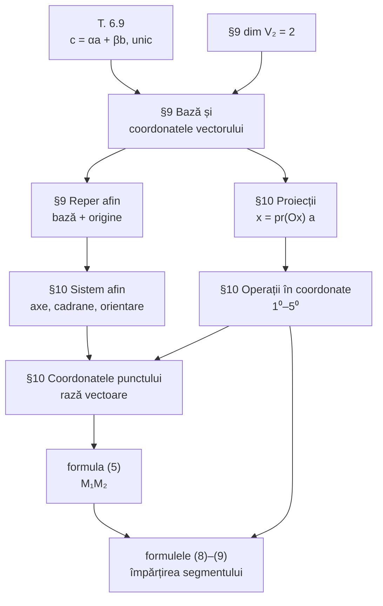

Formularul §9–§10 pe o singură pagină. Pentru demonstrații și figuri, urmați legăturile.

## 1. Spațiul $V_2$ (§9)

| Noțiune | Pe scurt |
|---|---|
| vector paralel cu planul $\pi$ | paralel cu o dreaptă din $\pi$; $\vec{0}$ e paralel cu orice plan |
| sistem de vectori coplanari | **toți** vectorii paraleli cu un plan |
| dimensiunea lui $V_2$ | **2**: există 2 vectori independenți, oricare 3 sunt dependenți |
| [[Bază]] | pereche **ordonată** $\{\vec{a}, \vec{b}\}$ de vectori necoliniari |
| coordonatele în bază | $\vec{c} = \alpha\vec{a} + \beta\vec{b}$ (unic) $\Rightarrow \vec{c} = \{\alpha;\ \beta\}_{\{\vec{a},\vec{b}\}}$ |
| [[Reper afin]] | $R = \{O, \vec{e}_1, \vec{e}_2\}$ — bază + origine |

**Tipurile de repere:** afin (general) · cartezian ($\lvert\vec{e}_1\rvert = \lvert\vec{e}_2\rvert$) · rectangular ($\vec{e}_1 \perp \vec{e}_2$) · rectangular cartezian ($\{O, \vec{i}, \vec{j}\}$, unitari și perpendiculari).

## 2. Sistemul afin de coordonate (§10)

- axele $(Ox) = (OE_1)$ — abscise, $(Oy) = (OE_2)$ — ordonate; pot fi **oblice**;
- cadranul I — între direcțiile pozitive; semne: I $(+,+)$, II $(-,+)$, III $(-,-)$, IV $(+,-)$;
- orientare **stângă** = $Ox \to Oy$ contrar acelor = **pozitivă** (în acest curs);
- unghiul orientat $\widehat{(\vec{a}, \vec{b})}$: rotim $\vec{a}$ contrar acelor până la $\vec{b}$.

## 3. Coordonatele vectorilor

$$
\vec{a} = \vec{OA} = \vec{OA_1} + \vec{OA_2} = x\vec{e}_1 + y\vec{e}_2 = \{x;\ y\}
$$

$$
x = \operatorname{pr}_{(Ox)}\vec{a} = \frac{P_{(Ox)}\vec{a}}{\vec{e}_1}, \qquad y = \operatorname{pr}_{(Oy)}\vec{a} = \frac{P_{(Oy)}\vec{a}}{\vec{e}_2}
$$

**T. 10.4:** $P_u(\vec{a} + \vec{b}) = P_u\vec{a} + P_u\vec{b}$ și $\operatorname{pr}_u(\vec{a} + \vec{b}) = \operatorname{pr}_u\vec{a} + \operatorname{pr}_u\vec{b}$.

Cu $\vec{a} = \{x_1; y_1\}$, $\vec{b} = \{x_2; y_2\}$:

| # | Proprietate | Formulă |
|---|---|---|
| 1⁰ | egalitate | $\vec{a} = \vec{b} \iff x_1 = x_2,\ y_1 = y_2$ |
| 2⁰ | sumă / diferență | $\vec{a} \pm \vec{b} = \{x_1 \pm x_2;\ y_1 \pm y_2\}$ |
| 3⁰ | înmulțire cu număr | $\alpha\vec{a} = \{\alpha x_1;\ \alpha y_1\}$ |
| 4⁰ | $\vec{b} = \alpha\vec{a}$ | $x_2 = \alpha x_1,\ y_2 = \alpha y_1$ |
| 5⁰ | coliniaritate | $\vec{a} \parallel \vec{b} \iff x_1y_2 - x_2y_1 = 0$ |
| 10.5 | combinație liniară | coordonatele se combină cu aceiași coeficienți |

## 4. Coordonatele punctelor

| Formula | Enunț |
|---|---|
| def. 10.7 | $M(x;\ y) \iff \vec{OM} = \{x;\ y\}$ |
| (5) | $\vec{M_1M_2} = \{x_2 - x_1;\ y_2 - y_1\}$ |
| (6)–(7) | $\vec{M_1M_0} = \lambda\,\vec{M_0M_2}$, $\ \lambda \ne -1$ |
| (8) | $x_0 = \dfrac{x_1 + \lambda x_2}{1 + \lambda}$, $\ y_0 = \dfrac{y_1 + \lambda y_2}{1 + \lambda}$ |
| (9) | $x_0 = \dfrac{x_1 + x_2}{2}$, $\ y_0 = \dfrac{y_1 + y_2}{2}$ (mijlocul, $\lambda = 1$) |

## 5. Harta logică §9–§10

## 6. Capcane frecvente

> [!warning] De verificat la fiecare problemă
> 1. **Proiecția pe $Ox$ se face paralel cu $Oy$**, nu perpendicular — decât în reperul rectangular.
> 2. **„Extremitate minus origine":** $\vec{M_1M_2} = \{x_2 - x_1;\ \dots\}$, nu invers.
> 3. **Forma cu proporții** $\tfrac{x_1}{x_2} = \tfrac{y_1}{y_2}$ nu merge când o coordonată e $0$ — folosiți $x_1y_2 - x_2y_1 = 0$.
> 4. **Raportul $\lambda$ depinde de ordinea capetelor** și de semnul bucăților: în afara segmentului $\lambda < 0$.
> 5. **$\lambda \ne -1$** — altfel formula (8) împarte la zero.
> 6. **Punct $M(x; y)$ ≠ vector $\{x; y\}$** — coincid doar prin raza vectoare.
> 7. **Terminologie:** „orientare stângă" și „reper cartezian" au în acest curs sensuri care diferă de alte manuale.

## Erori găsite în manual (§9–§10)

| Pagina | În manual | Corect |
|---|---|---|
| 40 | „pentru orice vector $\vec{c} \in V$" | $\vec{c} \in V_2$ |
| 41 | ex. 9.3 b): $\vec{AB}$, $\vec{A_1C}$, $\vec{B_1D}$ „nu sunt coplanari" | **sunt** coplanari: $\vec{A_1C} - \vec{B_1D} = 2\vec{AB}$ |
| 46 | relațiile (3)–(4) scrise cu $\operatorname{pr}_u$ | proiecția **geometrică** $P_u$ acolo unde e vector |
| 48 | $x_0 - x_1 = \lambda(x_2 - x_1)$ | $x_0 - x_1 = \lambda(x_2 - x_0)$ (analog pentru $y$) |
| 48 | „după (2) avem" | după proprietatea **2⁰** |
| 49 | „Cu ajutorul (4) se determină…" | formula **(8)** |

## Legături

- Index: [[Geometrie analitică în plan]]
- Recapitularea anterioară: [[Recapitulare — vectori]]
- Continuare: [[Recapitulare — metrica planului]] — formularul §11–§13
- Notații: [[Notații și simboluri]]
