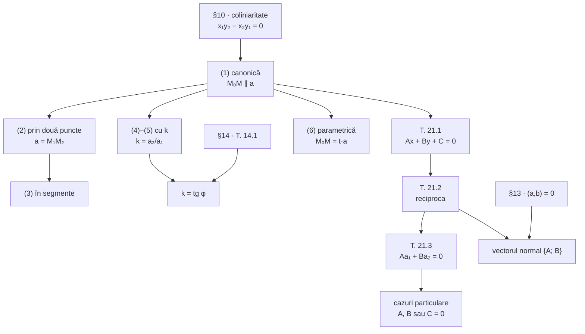

Formularul §20–§21 pe o singură pagină. Pentru demonstrații și figuri, urmați legăturile.

> [!tip] Ideea capitolului
> Un punct $M$ e pe dreapta $d$ exact când vectorul de la un punct cunoscut $M_0 \in d$ la $M$ e **paralel** cu $d$. Toate ecuațiile dreptei sunt această frază scrisă în coordonate — cu condiția de coliniaritate din §10.

## 1. Vectorul director

Orice vector **nenul** paralel cu $d$. Oricare doi vectori directori sunt coliniari. Din două puncte: $\vec{M_1M_2}$.

## 2. Formele ecuației (§20)

| # | Forma | Ecuația | Condiții |
|---|---|---|---|
| (1) | canonică (determinant) | $\begin{vmatrix} x - x_0 & a_1 \\ y - y_0 & a_2 \end{vmatrix} = 0$ | — |
| (1′) | canonică (fracții) | $\dfrac{x - x_0}{a_1} = \dfrac{y - y_0}{a_2}$ | $a_1, a_2 \ne 0$ |
| (1″) | canonică (fără fracții) | $a_2(x - x_0) - a_1(y - y_0) = 0$ | — |
| (2) | prin două puncte | $\begin{vmatrix} x - x_1 & x_2 - x_1 \\ y - y_1 & y_2 - y_1 \end{vmatrix} = 0$ | — |
| (2′) | prin două puncte (fracții) | $\dfrac{x - x_1}{x_2 - x_1} = \dfrac{y - y_1}{y_2 - y_1}$ | numitori $\ne 0$ |
| (3) | în segmente | $\dfrac{x}{a} + \dfrac{y}{b} = 1$ | $a, b \ne 0$ |
| (4) | prin punct, cu $k$ | $y - y_0 = k(x - x_0)$ | $d \nparallel (Oy)$ |
| (5) | cu coeficient unghiular | $y = kx + b$ | $d \nparallel (Oy)$ |
| (6) | parametrică | $x = x_0 + a_1t$, $\ y = y_0 + a_2t$ | $t \in \mathbb R$ |

**Coeficientul unghiular:** $k = a_2/a_1$ (nu depinde de vectorul director). În sistem **rectangular cartezian** $k = \operatorname{tg}\varphi$ — unghiul cu $(Ox)$, determinat până la $180°$.

**Exemple:** ex. 20.1: $A(2;-5)$, $\vec a\{3;-5\}$ ⇒ $5x + 3y + 5 = 0$ · ex. 20.2: $A(2;-5)$, $B(-3;2)$ ⇒ $7x + 5y + 11 = 0$.

## 3. Ecuația generală (§21)

$$
Ax + By + C = 0, \qquad A^2 + B^2 > 0
$$

| Rezultat | Enunț | Sistem |
|---|---|---|
| T. 21.1 | orice dreaptă are o ecuație de gradul întâi: $A = a_2$, $B = -a_1$, $C = a_1y_0 - a_2x_0$ | afin |
| T. 21.2 | orice ecuație de gradul întâi e o dreaptă, cu vectorul director $\{-B;\ A\}$ | afin |
| T. 21.3 | $\vec v \parallel d \iff Av_1 + Bv_2 = 0$ | afin |
| vectorul normal | $\vec n = \{A;\ B\} \perp d$ | **rectangular cartezian** |
| coeficientul unghiular | $k = -A/B$ ($B \ne 0$) | afin |

**Cazuri particulare:** $C = 0$ ⇔ prin $O$ · $A = 0$ ⇔ paralelă cu $(Ox)$ ($A = C = 0$: axa $Ox$) · $B = 0$ ⇔ paralelă cu $(Oy)$ ($B = C = 0$: axa $Oy$).

## 4. Harta logică §20–§21

## 5. Capcane frecvente

> [!warning] De verificat la fiecare problemă
> 1. **Forma cu fracții (1′) cere numitori nenuli.** Pentru drepte paralele cu o axă, folosiți (1″).
> 2. **Verificați ecuația obținută cu două puncte**, nu cu unul: un singur punct nu prinde o greșeală la vectorul director.
> 3. **Dreptele verticale nu au $k$**; dreptele prin $O$ sau paralele cu axele nu au formă în segmente.
> 4. **$k = \operatorname{tg}\varphi$ doar în sistem rectangular cartezian**; în sistem afin, $k$ e doar un raport.
> 5. **Vectorul normal $\{A; B\}$ cere sistem rectangular cartezian**; vectorul director $\{-B; A\}$ — nu.
> 6. **Ecuația generală e determinată până la un factor**: $5x + 3y + 5 = 0$ și $-10x - 6y - 10 = 0$ sunt aceeași dreaptă.
> 7. **$A^2 + B^2 > 0$ e esențială**: $0x + 0y + C = 0$ nu e o dreaptă.

## Erori și scăpări în manual (§20–§21)

| Pagina | În manual | Corect |
|---|---|---|
| 94 | forma (1′) scrisă fără condiții | cere $a_1 \ne 0$ și $a_2 \ne 0$ (condiția apare abia la (2′)) |
| 96 | „numărul $k$ permite de aflat unghiul orientat $\varphi = \widehat{(\vec i, \vec a)}$" | doar până la $180°$ — $\vec a$ și $-\vec a$ dau același $k$; $k$ determină unghiul **dreptei** cu $(Ox)$ |
| 96 | „în aces caz" | „în acest caz" |
| 93–97 | numerotarea subsecțiunilor: 1⁰, 2⁰, 3., 4., 5⁰ | neuniformă; păstrată ca în manual |
| 97 | „$A^2 + + B^2 > 0$" | $A^2 + B^2 > 0$ |
| 97 | T. 21.2: „Să presupunem că $x_0, y_0$ este o careva soluție" | existența soluției trebuie arătată: dacă $B \ne 0$, $(0;\ -C/B)$; altfel $(-C/A;\ 0)$ |
| 98 | „vectoril director", „este parallel" | „vectorul director", „este paralel" |

## Legături

- Lecțiile: [[Ecuația canonică și ecuația dreptei prin două puncte]] · [[Ecuația în segmente, cu coeficient unghiular și parametrică]] · [[Ecuația generală. Teoremele 21.1–21.3]] · [[Poziția dreptei față de axe]]
- Anterior: [[Recapitulare — metrica planului]]
- [[Notații și simboluri]] · [[Geometrie analitică în plan]]
