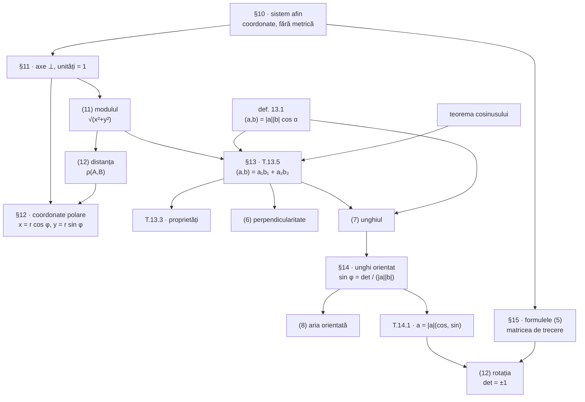

Formularul §11–§15 pe o singură pagină. Pentru demonstrații și figuri, urmați legăturile.

> [!tip] Firul celor cinci paragrafe
> §10 a dat **unde** se află un punct. §11 adaugă **cât de departe** (distanțe). §13 adaugă **sub ce unghi** (produsul scalar). §14 adaugă **în ce parte** (unghiul orientat) și, din el, **aria**. §15 arată cum se schimbă toate acestea când **schimbăm sistemul**. §12 nu adaugă nimic nou logic — oferă un al doilea limbaj, potrivit pentru figurile radiale.

## 1. Sistemul rectangular cartezian (§11)

$$
R = \{O,\ \vec i,\ \vec j\}, \qquad \lvert\vec i\rvert = \lvert\vec j\rvert = 1, \qquad \vec i \perp \vec j
$$

Caz particular al sistemului afin ⇒ **toate** formulele §10 rămân valabile. În plus:

| # | Formulă | |
|---|---|---|
| (10) | $x = \lvert\vec a\rvert\cos\varphi = \operatorname{pr}_{(Ox)}\vec a$, $\ y = \lvert\vec a\rvert\sin\varphi = \operatorname{pr}_{(Oy)}\vec a$ | proiecții **ortogonale** |
| — | $\vec a = \{\lvert\vec a\rvert\cos\varphi;\ \lvert\vec a\rvert\sin\varphi\}$; pentru $\lvert\vec a\rvert=1$: $\vec a = \{\cos\varphi;\ \sin\varphi\}$ | forma trigonometrică |
| — | $\operatorname{tg}\varphi = \dfrac{y}{x}$ | **nu** determină singur unghiul |
| (11) | $\lvert\vec a\rvert = \sqrt{x^2+y^2}$ | modulul |
| (12) | $\rho(A,B) = \sqrt{(x_2-x_1)^2 + (y_2-y_1)^2}$ | distanța |

**Exemplul 11.1:** $A(-2;2)$, $B(2;6)$, $C(10;-2)$ ⇒ $AB = 4\sqrt2$, $AC = 4\sqrt{10}$, $BC = 8\sqrt2$. (Triunghiul este dreptunghic în $B$: $32 + 128 = 160$.)

## 2. Coordonate polare (§12)

Reper polar $R = \{O, \vec i\}$: polul $O$, axa polară $[OE)$. Punctul $M(r;\ \varphi)$, cu $0 \le r < \infty$, $0 \le \varphi < 2\pi$ (se admit și unghiuri negative).

| De la | La | Formule |
|---|---|---|
| $(r;\varphi)$ | $(x;y)$ | $x = r\cos\varphi$, $\ y = r\sin\varphi$ |
| $(x;y)$ | $(r;\varphi)$ | $r = \sqrt{x^2+y^2}$; $\ \cos\varphi = x/r$, $\ \sin\varphi = y/r$ |

Distanța direct în polare (teorema cosinusului în $OAB$):

$$
\rho(A,B) = \sqrt{r_1^2 + r_2^2 - 2r_1r_2\cos(\varphi_2-\varphi_1)}
$$

**Polul este excepția:** $r = 0$ și $\varphi$ nedeterminat; corespondența e biunivocă doar pe $P \setminus \{O\}$.

## 3. Unghiul dintre vectori (§13)

$\widehat{(\vec a, \vec b)}$ = unghiul $AOB$, cu $\vec{OA} = \vec a$, $\vec{OB} = \vec b$. **Nu depinde de $O$** (unghiuri cu laturi respectiv paralele și la fel orientate sunt congruente). Domeniul: $[0;\ \pi]$, neorientat.

$\vec a \perp \vec b \iff \widehat{(\vec a, \vec b)} = \pi/2$. **Convenție:** vectorul nul e perpendicular pe orice vector.

## 4. Produsul scalar (§13)

| # | Formulă |
|---|---|
| (1) | $(\vec a, \vec b) = \lvert\vec a\rvert\cdot\lvert\vec b\rvert\cdot\cos\widehat{(\vec a,\vec b)}$ |
| (2) | $\vec a^{\,2} = (\vec a, \vec a) = \lvert\vec a\rvert^2$, deci $\lvert\vec a\rvert = \sqrt{\vec a^{\,2}}$ |
| (3) | $(\vec a, \vec b) = a_1b_1 + a_2b_2$ — **numai în bază ortonormată** |
| (4) | $(\vec a, \vec b) = \tfrac12\left(\lvert\vec a\rvert^2 + \lvert\vec b\rvert^2 - \lvert\vec b-\vec a\rvert^2\right)$ |
| (6) | $\vec a \perp \vec b \iff a_1b_1 + a_2b_2 = 0$ |
| (7) | $\cos\widehat{(\vec a,\vec b)} = \dfrac{a_1b_1+a_2b_2}{\sqrt{a_1^2+a_2^2}\cdot\sqrt{b_1^2+b_2^2}}$ |

**Teorema 13.3:** $(\vec a,\vec b) = (\vec b,\vec a)$ · $(\alpha\vec a,\vec b) = \alpha(\vec a,\vec b)$ · $(\vec a+\vec b,\vec c) = (\vec a,\vec c)+(\vec b,\vec c)$.

**Consecința 13.4:** $(\vec a+\vec b,\ \vec c+\vec d) = (\vec a,\vec c)+(\vec a,\vec d)+(\vec b,\vec c)+(\vec b,\vec d)$.
Caz particular: $\lvert\vec a+\vec b\rvert^2 = \lvert\vec a\rvert^2 + 2(\vec a,\vec b) + \lvert\vec b\rvert^2$.

**Semnul:** $+$ unghi ascuțit · $0$ unghi drept · $-$ unghi obtuz.

**Fizic:** lucrul mecanic $A = (\vec F,\ \vec{M_1M_2})$.

## 5. Ce **nu** are produsul scalar

| Proprietatea numerelor | La produsul scalar |
|---|---|
| rezultat de aceeași natură | **nu** — dă un număr; $\vec a^{\,3}$ nu are sens |
| $\alpha\beta = 0 \Rightarrow \alpha = 0$ sau $\beta = 0$ | **nu** — $\{1;0\}$ și $\{0;1\}$ |
| simplificare prin factor comun | **nu** — din $(\vec a,\vec b) = (\vec a,\vec c)$ rezultă doar $\vec a \perp (\vec b - \vec c)$ |
| asociativitate | **nu** — $(\vec a,\vec b)\vec c$ e coliniar cu $\vec c$, $(\vec b,\vec c)\vec a$ cu $\vec a$ |

## 6. Unghiul orientat (§14)

$\widehat{(\vec a, \vec b)} \in (-\pi;\ \pi]$: pozitiv dacă $\vec b$ se obține din $\vec a$ prin rotație **contrar acelor**, negativ dacă **în sensul acelor**.

| # | Formulă | |
|---|---|---|
| (1) | $\sin\widehat{(\vec a,\vec b)} = -\sin\widehat{(\vec b,\vec a)}$, $\ \cos\widehat{(\vec a,\vec b)} = \cos\widehat{(\vec b,\vec a)}$ | ordinea contează |
| (2) | $\widehat{(\vec a,\vec b)} + \widehat{(\vec b,\vec c)} \equiv \widehat{(\vec a,\vec c)} \pmod{2\pi}$ | doar sin și cos coincid |
| (3) | $a_1 = \lvert\vec a\rvert\cos\widehat{(\vec i,\vec a)}$, $\ a_2 = \lvert\vec a\rvert\sin\widehat{(\vec i,\vec a)}$ | T. 14.1, bază ortonormată **dreaptă** |
| (5) | $\cos\varphi = \dfrac{a_1b_1 + a_2b_2}{\lvert\vec a\rvert\lvert\vec b\rvert}$, $\ \sin\varphi = \dfrac{a_1b_2 - a_2b_1}{\lvert\vec a\rvert\lvert\vec b\rvert}$ | unghiul orientat în coordonate |
| (6) | $\operatorname{tg}\varphi = \dfrac{a_1b_2 - a_2b_1}{a_1b_1 + a_2b_2}$ | **nu** determină singur unghiul |

**Determinantul $a_1b_2 - a_2b_1$:** $= 0$ ⇔ coliniari · $> 0$ ⇔ $\vec b$ „la stânga" lui $\vec a$ · $\lvert\cdot\rvert$ = aria paralelogramului pe $\vec a$, $\vec b$.

## 7. Aria triunghiului (§14)

| # | Formulă | |
|---|---|---|
| (7) | $S = \frac12\lvert\vec{AB}\rvert\lvert\vec{AC}\rvert\sin\widehat{(\vec{AB},\vec{AC})}$ | cu unghi orientat ⇒ arie cu semn |
| (8) | $S_{\Delta ABC} = \frac12\begin{vmatrix} x_2 - x_1 & y_2 - y_1 \\ x_3 - x_1 & y_3 - y_1 \end{vmatrix}$ | **arie orientată**: $> 0$ dacă $A \to B \to C$ e contrar acelor |
| (9) | $S_{\Delta ABC} = \frac12\operatorname{mod}\begin{vmatrix} \dots \end{vmatrix}$ | aria obișnuită |

**Ex. 14.5:** $A(3;7)$, $B(2;-3)$, $C(-1;4)$ ⇒ $\det = -37$, $S_{\Delta ABC} = \frac{37}{2}$, $S_{ABCD} = 37$, $D(0;\ 14)$.

## 8. Transformarea coordonatelor (§15)

Sistemul nou: originea $O'(x_0;\ y_0)$, vectorii $\vec e_1{}' = \{c_{11};\ c_{21}\}$, $\vec e_2{}' = \{c_{12};\ c_{22}\}$ — toate **în sistemul vechi**.

| # | Caz | Formulele |
|---|---|---|
| (5) | general | $x = c_{11}x' + c_{12}y' + x_0$, $\ y = c_{21}x' + c_{22}y' + y_0$ |
| (6) | translație | $x = x' + x_0$, $\ y = y' + y_0$ |
| (7) | aceeași origine | $x = c_{11}x' + c_{12}y'$, $\ y = c_{21}x' + c_{22}y'$ |
| (9) | rectangular, aceeași orientare | $x = x'\cos\alpha - y'\sin\alpha + x_0$, $\ y = x'\sin\alpha + y'\cos\alpha + y_0$ |
| (10) | rotație în jurul originii | (9) cu $x_0 = y_0 = 0$ |
| (11) | rectangular, orientări opuse | $x = x'\cos\alpha + y'\sin\alpha + x_0$, $\ y = x'\sin\alpha - y'\cos\alpha + y_0$ |
| (12) | unificat | $x = x'\cos\alpha - \varepsilon y'\sin\alpha + x_0$, $\ y = x'\sin\alpha + \varepsilon y'\cos\alpha + y_0$ |

**Matricea de trecere** $C = (c_{ij})$: coloanele = vectorii noi. $\det C \ne 0$. Între baze ortonormate $\det C = \varepsilon = \pm 1$; inversa e transpusa.

## 9. Harta logică §11–§15

```mermaid
graph TD
  A["§10 · sistem afin<br/>coordonate, fără metrică"] --> B["§11 · axe ⊥, unități = 1"]
  B --> C["(11) modulul<br/>√(x²+y²)"]
  C --> D["(12) distanța<br/>ρ(A,B)"]
  B --> E["§12 · coordonate polare<br/>x = r cos φ, y = r sin φ"]
  D --> E
  C --> F["§13 · T.13.5<br/>(a,b) = a₁b₁ + a₂b₂"]
  G["def. 13.1<br/>(a,b) = |a||b| cos α"] --> F
  H["teorema cosinusului"] --> F
  F --> I["T.13.3 · proprietăți"]
  F --> J["(6) perpendicularitate"]
  F --> K["(7) unghiul"]
  G --> K
  K --> L["§14 · unghi orientat<br/>sin φ = det / (|a||b|)"]
  L --> M["(8) aria orientată"]
  L --> N["T.14.1 · a = |a|(cos, sin)"]
  A --> P["§15 · formulele (5)<br/>matricea de trecere"]
  N --> Q["(12) rotația<br/>det = ±1"]
  P --> Q
```

> [!note] Ordinea reală a demonstrațiilor
> Manualul enunță teorema 13.3 înaintea teoremei 13.5, dar o **demonstrează folosind formula (3)** din 13.5. Nu e cerc vicios: 13.5 se sprijină doar pe definiția 13.1, teorema cosinusului, formula (11) și criteriul de coliniaritate din §5. Lanțul logic este **13.5 → 13.3**.

## 10. Capcane frecvente

1. **Formulele metrice cer reper rectangular cartezian.** Într-un reper oblic sau cu unități inegale, (10)–(12), (3), (6), (7) sunt **false**.
2. **$\operatorname{tg}\varphi = y/x$ nu identifică unghiul** — nu distinge cadranele opuse. Folosiți perechea $(\cos\varphi, \sin\varphi)$.
3. **Vectorii unui unghi trebuie să plece din vârful cercetat.** Pentru unghiul din $B$ se folosesc $\vec{BA}$ și $\vec{BC}$, nu $\vec{AB}$ și $\vec{BC}$ — altfel unghiul iese suplementar.
4. **Ordinea contează la (5), nu la (12).** $\vec{AB} = -\vec{BA}$, dar $\rho(A,B) = \rho(B,A)$.
5. **Polul nu are unghi polar.** Formulele $\cos\varphi = x/r$ își pierd sensul pentru $r = 0$.
6. **$\vec a^{\,2}$ este un număr.** Nu se poate itera, deci $\vec a^{\,3}$ nu există.
7. **Produsul scalar nul nu înseamnă vector nul.** Înseamnă perpendicularitate.
8. **„Dreaptă” și „stângă” își schimbă sensul între §10 și §14.** Rețineți rotația: contrar acelor = pozitiv, în ambele paragrafe.
9. **Aria din (8) are semn.** Pentru aria obișnuită luați valoarea absolută (9).
10. **În matricea de trecere, vectorii noi sunt coloane, nu rânduri.** Altfel obțineți transpusa — și formule greșite.
11. **Teorema 14.1 cere bază dreaptă.** Cu $\vec j$ la $-90°$ de $\vec i$, formula lui $a_2$ își schimbă semnul.

## Erori găsite în manual (§11–§15)

| Loc | Ce scrie | Ce ar trebui |
|---|---|---|
| p. 50–51 | „sistemul rectangular cartezian **cartezian**" (de mai multe ori) | „sistemul rectangular cartezian" — cuvânt repetat |
| p. 53 vs. p. 54 | $0 \le r < \infty$, dar imediat $r = \lvert\vec{OM}\rvert > 0$ | $r \ge 0$ în general; $r > 0$ doar pentru $M \ne O$ |
| **p. 55, ex. 12.1** | al doilea termen tratat ca $\left(4\sqrt3 - \frac{5\sqrt3}{2}\right)^2 = \frac{27}{4}$, deși rândul anterior scrie corect $4\sqrt3 - \frac{5\sqrt2}{2}$; rezultat $\sqrt{\frac{141}{4}-20\sqrt2} \approx 2{,}64$ | $\lvert AB\rvert = \sqrt{89 - 20\sqrt2 - 20\sqrt6} \approx 3{,}42$ — verificat cu teorema cosinusului ($89 - 80\cos 15°$). Rezultatul manualului este **imposibil**: ar fi mai mic decât $r_2 - r_1 = 3$ |
| p. 57 | teorema 13.3 demonstrată prin formula (3) din teorema 13.5, enunțată ulterior | referință înainte; nu e cerc vicios, dar ordinea logică este 13.5 → 13.3 |
| p. 59 | $\big((\vec a, \vec b), \vec c\big) \neq \big(\vec a, (\vec b, \vec c)\big)$ | paranteza interioară e un **număr**, deci exteriorul nu e produs scalar; sensul corect e $(\vec a,\vec b)\vec c \ne (\vec b,\vec c)\vec a$ |
| **p. 60, ex. 13.8** | „de unde obținem $\beta = m(\angle BCA) = 45°$" | $\beta = m(\angle ABC)$; $\angle BCA$ este $\gamma$, folosit trei rânduri mai jos |
| **p. 60–61, 67 vs. p. 44** | rotația contrar acelor e numită orientare „dreaptă” (în §10: „stângă”) | sensul pozitiv e același; doar numele e inversat — rețineți sensul rotației |
| p. 60–61 vs. p. 45 | unghiul orientat în $(-\pi;\ \pi]$ (în §10: $[0;\ 2\pi)$) | două convenții; diferă cu $2\pi$, au aceleași sin și cos |
| p. 61, teorema 14.1 | „într-o bază ortonormată” | trebuie **bază ortonormată dreaptă**; demonstrația folosește $\widehat{(\vec j, \vec i)} = -\pi/2$ |
| p. 63, formula (7) | „sau” între $\frac12\lvert AB\rvert\lvert AC\rvert\sin\hat A$ și formula cu unghi orientat | nu sunt echivalente: a doua dă **arie cu semn** |
| p. 64, fig. 55 | $A(3;7)$ desenat jos, $B(2;-3)$ sus | desen schematic, inversat față de coordonate; rezultatul (37) e corect |
| **p. 66** | „vectorii $\vec e_1$ și $\vec e_2$ sunt necoliniari, atunci $\det C \ne 0$” | $\vec e_1{}'$ și $\vec e_2{}'$ — coloanele lui $C$ sunt vectorii **noi** |
| **p. 66, translația** | matricea de trecere $\begin{pmatrix} 1 & 0 \\ 1 & 0 \end{pmatrix}$ | matricea unitate $\begin{pmatrix} 1 & 0 \\ 0 & 1 \end{pmatrix}$; cea tipărită e singulară |
| p. 67 | titlul „B. Rotația axelor” pentru formulele (7) din cazul afin | (7) e o schimbare de bază oarecare; rotație e doar cazul rectangular cu aceeași orientare |

Vezi și tabelul complet din [[Surse originale]].

## Legături

- Lecțiile: [[Sistemul rectangular cartezian. Coordonatele și modulul unui vector]] · [[Distanța dintre două puncte]] · [[Reperul polar. Coordonate polare]] · [[Trecerea între coordonate polare și carteziene]] · [[Unghiul dintre doi vectori. Perpendicularitate]] · [[Produsul scalar — definiție și interpretare]] · [[Proprietățile produsului scalar. Expresia în coordonate]] · [[Ce nu se transferă de la numere. Aplicații]] · [[Unghiul orientat dintre doi vectori]] · [[Coordonatele vectorului prin unghiul orientat]] · [[Aria triunghiului în coordonate]] · [[Transformarea sistemului afin de coordonate]] · [[Rotația sistemului rectangular cartezian]]
- Anterior: [[Recapitulare — baze și coordonate]]
- [[Notații și simboluri]] · [[Geometrie analitică în plan]]
