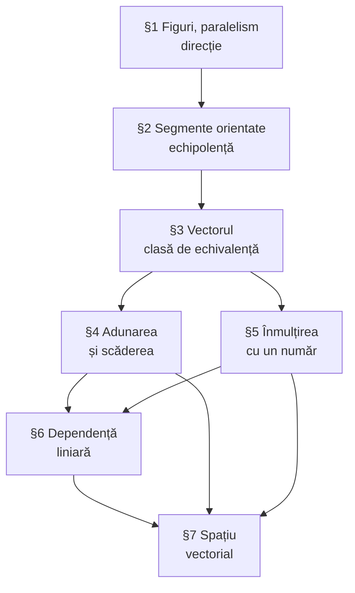

Formularul complet al capitolelor §3–§7, într-un singur loc. Pentru demonstrații, urmați legăturile.

## 1. Obiectul

| Noțiune | Definiție scurtă |
|---|---|
| [[Vector]] | clasă de [[Segment orientat\|segmente orientate]] [[Echipolență\|echipolente]] |
| [[Vector liber]] | vector determinat doar de direcție, sens și lungime |
| [[Modulul vectorului]] | $\lvert \vec{a} \rvert$ — lungimea oricărui reprezentant |
| [[Vector opus]] | $-\vec{a} = \vec{BA}$ dacă $\vec{a} = \vec{AB}$ |
| Vector nul | $\vec{0}$, cu $\lvert \vec{0} \rvert = 0$; nu are direcție |

**Teorema reprezentantului unic.** Pentru orice $\vec{a}$ și orice punct $O$ există un **unic** $M$ cu $\vec{OM} = \vec{a}$.

## 2. Relații între vectori

| Relație | Notare | Înseamnă |
|---|---|---|
| coliniaritate | $\vec{a} \parallel \vec{b}$ | există o dreaptă la care ambii sunt paraleli |
| la fel orientați | $\vec{a} \uparrow\uparrow \vec{b}$ | coliniari, același sens |
| opus orientați | $\vec{a} \uparrow\downarrow \vec{b}$ | coliniari, sensuri opuse |
| coplanaritate | — | există un plan la care toți trei sunt paraleli |

**Convenții:** $\vec{0} \parallel \vec{a}$ și $\vec{0} \uparrow\uparrow \vec{a}$, pentru orice $\vec{a}$.

## 3. Operații

### Adunarea

$$
\vec{AC} = \vec{AB} + \vec{BC} \quad \text{(relația lui Chasles — orice trei puncte)}
$$

- **regula triunghiului** — cap la cap; funcționează și pentru vectori coliniari;
- **regula poligonului** — generalizarea pentru $n$ vectori;
- **regula paralelogramului** — din origine comună, suma e diagonala; **doar** vectori necoliniari.

### Scăderea

$$
\vec{a} - \vec{b} = \vec{c} \iff \vec{b} + \vec{c} = \vec{a}, \qquad \vec{a} - \vec{b} = \vec{a} + (-\vec{b})
$$

Construcție: din origine comună, $\vec{a} - \vec{b} = \vec{BA}$ — de la vârful lui $\vec{b}$ spre vârful lui $\vec{a}$.

### Înmulțirea cu un număr

$$
\vec{b} = \alpha\vec{a} \quad \text{cu} \quad \lvert \vec{b} \rvert = \lvert \alpha \rvert \cdot \lvert \vec{a} \rvert, \qquad \vec{b} \uparrow\uparrow \vec{a} \iff \alpha \ge 0, \qquad \vec{b} \uparrow\downarrow \vec{a} \iff \alpha < 0
$$

$$
0 \cdot \vec{a} = \vec{0}, \qquad 1 \cdot \vec{a} = \vec{a}, \qquad (-1) \cdot \vec{a} = -\vec{a}
$$

## 4. Cele opt proprietăți (structura de spațiu vectorial)

$$
\begin{aligned}
&\text{1)}\ \vec{a} + \vec{b} = \vec{b} + \vec{a} &\quad &\text{5)}\ 1 \cdot \vec{a} = \vec{a} \\
&\text{2)}\ (\vec{a} + \vec{b}) + \vec{c} = \vec{a} + (\vec{b} + \vec{c}) &\quad &\text{6)}\ \beta(\alpha\vec{a}) = (\beta\alpha)\vec{a} \\
&\text{3)}\ \vec{a} + \vec{0} = \vec{a} &\quad &\text{7)}\ \alpha(\vec{a} + \vec{b}) = \alpha\vec{a} + \alpha\vec{b} \\
&\text{4)}\ \vec{a} + (-\vec{a}) = \vec{0} &\quad &\text{8)}\ (\alpha + \beta)\vec{a} = \alpha\vec{a} + \beta\vec{a}
\end{aligned}
$$

## 5. Teoremele — enunțuri

| Teoremă | Enunț | Notă |
|---|---|---|
| **5.3** | $\vec{a}, \vec{b} \ne \vec{0}$ coliniari $\iff \exists\, \lambda:\ \vec{a} = \lambda\vec{b}$ | [[Raportul a doi vectori coliniari\|→]] |
| **6.5** | $\sigma$ dependent $\iff$ un vector e combinație liniară a celorlalți | [[Teoremele fundamentale ale dependenței liniare\|→]] |
| **6.6** | $\vec{0} \in \sigma \Rightarrow \sigma$ dependent | [[Teoremele fundamentale ale dependenței liniare\|→]] |
| **6.7** | subsistem dependent $\Rightarrow$ sistem dependent | [[Teoremele fundamentale ale dependenței liniare\|→]] |
| **6.8** | sistem independent $\Rightarrow$ subsisteme independente | corolar al lui 6.7 |
| **6.9** | $\vec{a}, \vec{b}$ necoliniari, $\vec{c}$ coplanar cu ei $\Rightarrow \vec{c} = \alpha\vec{a} + \beta\vec{b}$, **unic** | [[Descompunerea unui vector după doi vectori necoliniari\|→]] |
| **6.10** | 2 vectori dependenți $\iff$ coliniari | [[Coliniaritate, coplanaritate și dependență liniară\|→]] |
| **6.11** | 3 vectori dependenți $\iff$ coplanari | [[Coliniaritate, coplanaritate și dependență liniară\|→]] |

## 6. Tabelul-cheie al dependenței liniare

| Vectori | Liniar **dependent** $\iff$ | Liniar **independent** $\iff$ |
|---|---|---|
| 1 | $\vec{a} = \vec{0}$ | $\vec{a} \ne \vec{0}$ |
| 2 | coliniari | necoliniari |
| 3 | coplanari | necoplanari |
| $\ge 4$ | întotdeauna | imposibil |

## 7. Harta logică a capitolului

## 8. Capcane frecvente

> [!warning] De verificat la fiecare problemă
> 1. **$\overline{AB}$ vs. $\vec{AB}$** — segment orientat (obiect) vs. vector (clasă).
> 2. **Regula paralelogramului nu merge la vectori coliniari** — folosiți regula triunghiului.
> 3. **Sensul diferenței** — $\vec{a} - \vec{b}$ merge *de la* vârful lui $\vec{b}$ *spre* vârful lui $\vec{a}$.
> 4. **T. 5.3 cere vectori nenuli** — cazul $\vec{0}$ se tratează separat.
> 5. **„Cel puțin unul", nu „oricare"** — în teorema 6.5, doar vectorii cu coeficient nenul se izolează.
> 6. **Raportul $\vec{a}/\vec{b}$ nu e împărțire de vectori** — e definit doar pentru vectori coliniari, cu $\vec{b} \ne \vec{0}$, și dă un **număr**.

## Legături

- Index: [[Geometrie analitică în plan]]
- Notații: [[Notații și simboluri]]
- Aplicații: [[Probleme rezolvate — vectori]]
- Continuare: [[Recapitulare — baze și coordonate]]
